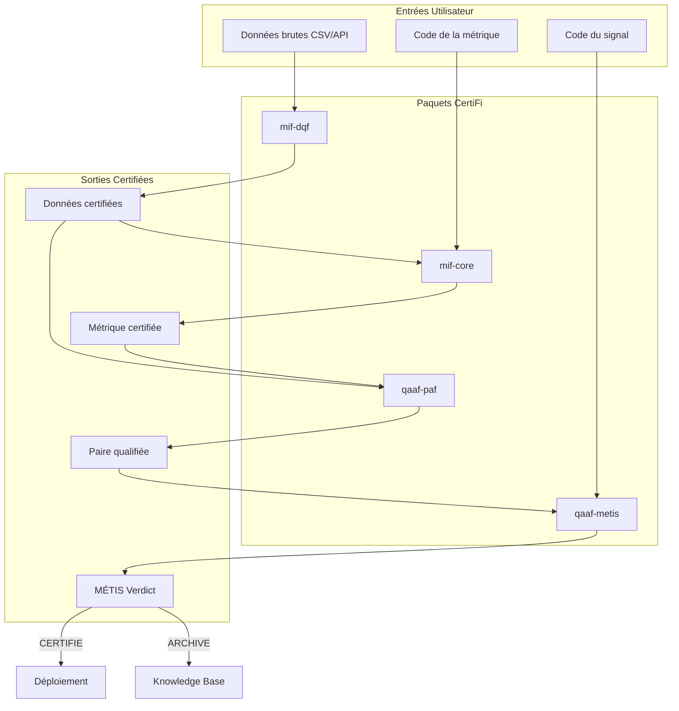

Comment uitiliser tout ce qu'on a appris avec ses documents experimentaux pour ameliorer et creer QAAF STUDIO pour la version v3 ?
----------
## 1. Synthèse des enseignements clés des documents expérimentaux

Les documents fournis (mise à jour de la base de connaissances QAAF, PAF, revue critique du Sharpe, proposition CNSR, synthèse QAAF-R, et conception de QAAF Studio 3.0) convergent vers un ensemble cohérent de leçons méthodologiques :

| Document | Enseignement central | Implication pour QAAF Studio 3.0 |
|----------|----------------------|----------------------------------|
| **QAAF_KB_Update_Avril2026.md** | Le biais DCA fausse les comparaisons ; la règle 60/40 ≈ 50/50 ; OOS 2023‑2024 est un bull market exceptionnel ; H9+EMA60j surpasse toute la machinerie géométrique. | Nécessité d’un moteur de backtest **lump sum** uniquement, avec benchmarks passifs (B_5050) systématiques, et intégration du test de permutation pour neutraliser l’effet bull market. |
| **PAF_Pair_Adequacy_Framework.md** | Le pré‑protocole PAF (Directions 1→2→3) évite de perdre des mois sur une paire ou une classe de méthodes inadaptée. Règles d’arrêt explicites. | PAF doit être la **porte d’entrée obligatoire** pour toute nouvelle hypothèse de signal. Le Studio doit implémenter les trois directions de manière interactive. |
| **sharpe‑review.md + muti_metrics_review.md** | Le Sharpe classique appliqué à une paire croisée sans conversion en numéraire commun (USD) est trompeur ; le **Common‑Numeraire Sharpe Ratio (CNSR‑USD)** corrige ce biais. Le DSR (Deflated Sharpe Ratio) filtre le multiple testing. Le TCLO est la seule métrique numéraire‑invariante. | Le moteur du Studio doit **calculer automatiquement le CNSR‑USD** pour toute paire croisée, et fournir un tableau de bord multi‑métriques (Sortino, Calmar, Omega, DSR). |
| **qaaf_studio.md** | Architecture en 4 couches (Moteur unifié → Qualification (PAF+MIF) → Validation (MÉTIS) → Décision (KB+inventaire)). Règles d’arrêt globales, inventaire des lentilles. | C’est la **colonne vertébrale** du Studio. Il faut maintenant la concrétiser avec les bonnes métriques, les bons tests et une interface utilisable. |

**Conclusion préliminaire** : Le Studio 3.0 doit être **l’incarnation logicielle et procédurale** de ces enseignements, avec une emphase particulière sur la correction du biais de numéraire (CNSR) et l’intégration native du PAF.

---

## 2. Traduction des enseignements dans l’architecture du Studio (4 couches)

### Couche 1 – Moteur unifié (la « lumière de la pièce »)

**Améliorations concrètes issues des documents :**

- **Conversion systématique en numéraire USD** pour toute paire croisée (ex. PAXG/BTC) : le moteur doit disposer des séries de prix USD pour chaque actif et reconstruire les rendements USD du portefeuille via `r_USD = r_pair + r_base_currency_USD` (log‑rendements).
- **Calcul automatique du CNSR‑USD** avec trois variantes de taux sans risque : `rf_fed` (4 %), `rf_usdc_lending` (≈3 %), `rf_0` (0 %). Le CNSR devient la métrique de Sharpe par défaut affichée.
- **Métriques complémentaires obligatoires** : Sortino, Calmar, Omega, DSR (estimation du nombre d’essais N basée sur l’inventaire des lentilles testées).
- **Benchmarks passifs pré‑calculés** : B_5050, B_BTC, B_PAXG, **en CNSR‑USD** pour une comparaison homogène.
- **Gestion des splits IS/OOS** figée par projet (ex. IS = 2020‑06‑01 → 2023‑05‑31, OOS = 2023‑06‑01 → 2024‑12‑31). Le moteur interdit de modifier les splits en cours de session.

### Couche 2 – Qualification (PAF + MIF)

**Intégration native du PAF :**

- Le module PAF du Studio doit exécuter les trois directions en **moins de 30 minutes** grâce au moteur unifié :
  - **D1** : Comparaison MR_pur, H9 brut, signal candidat, benchmarks passifs → verdict immédiat.
  - **D2** : Comparaison signal complet vs signal sans composante X → identification des couches neutres.
  - **D3** : Test iso‑variance avec un lissage trivial (EMA) → distinction signal informationnel / artefact de friction.
- **Règle d’arrêt PAF** appliquée automatiquement : si B_passif domine et que la hiérarchie n’existe pas, la session est suspendue et un message suggère de requalifier la paire.

**MIF v5.0** reste le pipeline de certification des métriques atomiques, mais le Studio doit s’assurer que les métriques testées (ex. une nouvelle fonction de signal) sont évaluées sur des données **synthétiques** reproduisant les 5 faits empiriques de PAXG/BTC (dérive, kurtosis, corrélation oscillante, etc.).

### Couche 3 – Validation MÉTIS

**Améliorations basées sur les critiques du Sharpe :**

- **Question 2 (test de permutation)** : Utiliser le **CNSR‑USD** comme métrique de référence pour comparer à B_5050. La p‑value est calculée sur 10 000 permutations des signaux d’allocation.
- **Question 3 (stabilité du span EMA)** : La grille 20j‑120j doit être évaluée sur **IS uniquement** et la courbe de performance (CNSR) visualisée pour détecter un plateau ou un pic isolé.
- **Ajout d’une Question 4 (DSR)** : Pour toute stratégie candidate, calculer le DSR en estimant N = nombre de variantes testées dans la même « famille » (par ex. toutes les EMA testées). Si DSR < 0,95, la stratégie est marquée comme « suspecte de sur‑ajustement ».

### Couche 4 – Décision (Knowledge Base + inventaire)

- La KB doit désormais stocker pour chaque hypothèse testée :
  - Le **CNSR‑USD** (avec les trois Rf) sur IS et OOS.
  - Le verdict PAF (HIERARCHIE_CONFIRMEE, REGIMES_NEUTRES, etc.).
  - Le DSR et la p‑value du test de permutation.
- L’inventaire des lentilles inclut le statut **SUSPECT_DSR** pour les stratégies dont le Sharpe brut est bon mais le DSR faible.

---

## 3. Améliorations spécifiques au design actuel du Studio

Le document `qaaf_studio.md` pose des bases solides mais reste conceptuel. Voici les ajouts concrets tirés des autres documents :

### 3.1. Standardisation du CNSR comme métrique primaire

**Modification du `MetricsEngine` :**

```python
def compute_cnsr(returns_usd: pd.Series, rf_annual: float = 0.04) -> dict:
    """Calcule le Common-Numeraire Sharpe Ratio et ses variantes."""
    rf_daily = (1 + rf_annual) ** (1/252) - 1
    excess = returns_usd - rf_daily
    sharpe = excess.mean() / excess.std() * np.sqrt(252)
    
    # Version avec Rf=0% (crypto pure)
    sharpe_0 = returns_usd.mean() / returns_usd.std() * np.sqrt(252)
    
    return {
        'cnsr_usd_fed': sharpe,
        'cnsr_usd_0': sharpe_0,
        'sortino': sortino_ratio(returns_usd, rf_daily),
        'calmar': calmar_ratio(returns_usd),
        'omega': omega_ratio(returns_usd)
    }
```

### 3.2. Intégration du DSR dans le rapport MÉTIS

**Fonction DSR simplifiée (basée sur Bailey & López de Prado) :**

```python
def deflated_sharpe_ratio(returns: pd.Series, N_trials: int, rf: float = 0.04) -> float:
    """
    Estime la probabilité que le Sharpe observé ne soit pas dû au hasard.
    N_trials = nombre de variantes testées dans la même étude.
    """
    from scipy.stats import skew, kurtosis, norm
    
    T = len(returns)
    sr = sharpe_ratio(returns, rf) / np.sqrt(252)  # non annualisé
    
    skew_ = skew(returns)
    kurt_ = kurtosis(returns, fisher=False)  # kurtosis de Pearson
    
    # Seuil déflaté (approximation)
    sr0 = norm.ppf(1 - 1/(N_trials + 1)) / np.sqrt(T)
    
    # Dénominateur corrigeant pour la non-normalité
    denom = np.sqrt(1 - skew_ * sr + (kurt_ - 3)/4 * sr**2)
    
    dsr = norm.cdf((sr - sr0) * np.sqrt(T-1) / denom)
    return dsr
```

Le Studio maintiendra un compteur `N_trials` par famille de stratégies (ex. "EMA span variants") pour alimenter ce calcul.

### 3.3. Mode « Lump Sum » exclusif et avertissement DCA

Le moteur unifié n’autorisera que les simulations en capital initial fixe (lump sum). Si l’utilisateur tente une simulation DCA, un message d’avertissement explicite sera affiché :

> « Le mode DCA mesure l’accumulation de capital, pas la performance de la règle de rebalancement. Les Sharpe obtenus ne sont pas comparables. Utilisez le mode Lump Sum pour certifier une stratégie. »

### 3.4. Dashboard PAF interactif

Le Studio proposera une vue dédiée pour exécuter PAF :

- Sélection du signal candidat (ex. "H9 + EMA 60j")
- Clic sur "Run PAF D1" → affichage du tableau comparatif (MR_pur, H9, candidat, B_5050, B_BTC) avec CNSR‑USD, MDD, frais.
- Si verdict HIERARCHIE_CONFIRMEE, bouton "Run PAF D2" devient actif.
- À chaque étape, le verdict est stocké dans la KB avec un horodatage.

### 3.5. Inventaire dynamique des lentilles

L’inventaire sera matérialisé sous forme de fichier YAML ou JSON versionné, mis à jour automatiquement après chaque session :

```yaml
lentilles:
  - nom: "H9+EMA60j"
    statut: "active"
    paf_verdict: "H9_LISSE_SUPERIEUR"
    cnsr_oos: 1.76
    metis_q1: "en_cours"
  - nom: "QAAF-R"
    statut: "archivee"
    raison: "TPR_haut=0%, mecanisme mal compris"
```

---

## 4. Plan de mise en œuvre progressive (version 3.0)

### Phase 1 – Fondations (1-2 semaines)

- Mettre à jour le moteur de backtest (`RebalanceBacktester`) pour implémenter le CNSR‑USD et les métriques complémentaires.
- Ajouter les benchmarks passifs pré‑calculés (B_5050, B_BTC, B_PAXG) en CNSR.
- Créer la structure de la Knowledge Base (fichier JSON) avec l’inventaire initial.

### Phase 2 – Intégration du PAF (1 semaine)

- Développer le module PAF interactif (CLI ou notebook) exécutant D1, D2, D3 sur commande.
- Connecter les verdicts à la KB.

### Phase 3 – MÉTIS amélioré (1 semaine)

- Ajouter le test de permutation (Q2) avec CNSR.
- Implémenter le calcul du DSR.
- Visualisation de la grille EMA pour Q3.

### Phase 4 – Certification de H9+EMA60j (session pilote)

- Lancer la première session complète dans le Studio :
  - PAF déjà fait → MÉTIS Q1 (walk‑forward 5 fenêtres).
  - Q2 (permutation) et Q3 (stabilité EMA).
  - Calcul du DSR avec N estimé à 101 (grille 20‑120j).
- Mise à jour de la KB avec le résultat final.

---

## 5. Conclusion – Ce que QAAF Studio 3.0 apporte de plus

Le document `qaaf_studio.md` a posé les fondations architecturales. Les autres documents apportent la **substance méthodologique** qui manquait :

- **Le CNSR‑USD** résout le problème du numéraire pour les paires croisées et rend les comparaisons honnêtes.
- **Le PAF** devient un module interactif intégré, pas un protocole externe.
- **Le DSR** ajoute une couche de prudence contre le sur‑ajustement, critique en crypto.
- **L’inventaire des lentilles** et les règles d’arrêt explicites empêchent les boucles sans fin.

Le Studio 3.0 ainsi enrichi n’est pas un simple backtester : c’est un **environnement de recherche contraint et traçable**, où chaque hypothèse est testée dans des conditions identiques, avec des métriques fiables, et où les échecs sont documentés aussi rigoureusement que les succès. C’est la condition pour avancer de manière cumulative vers des stratégies robustes.

**Prochaine action immédiate** : Implémenter la Phase 1 du plan ci‑dessus pour disposer d’un moteur unifié calculant le CNSR‑USD et générant les benchmarks passifs.

-------------------

## Analyse de cohérence du développement QAAF Studio 3.0

Après examen des quatre parties du développement (`Part1_Layer1`, `Part2_Comparative`, `Part3_PAF_v2`, `Part4_METIS`), voici une évaluation structurée de la cohérence globale du projet.

---

### 1. Résumé du parcours réalisé

| Partie | Livrable | État constaté |
|--------|----------|---------------|
| **1 – Layer 1** | Moteur unifié avec `Backtester`, `MetricsEngine` (CNSR‑USD, DSR), `DataLoader` avec stub DQF, `SplitManager`, `BenchmarkFactory`. | **26/26 tests verts** ✅ |
| **2 – Session comparative** | `sessions/comparative_001/` testant 8 lentilles simultanément (benchmarks passifs + variantes EMA + filtre MA200). | **Pipeline validé**, résultats archivés en KB. |
| **3 – Layer 2 PAF** | Implémentation des trois directions PAF (`D1`, `D2`, `D3`) avec `PAFRunner` et règles d’arrêt. | **14/14 tests verts** (8 fonctionnels + 6 adverses) ✅ |
| **4 – Layer 3 MÉTIS** | `METISRunner` orchestrant Q1 (walk‑forward), Q2 (permutation), Q3 (stabilité EMA), Q4 (DSR). | **13/13 tests unitaires verts** ✅ ; validation sur données réelles reproduit le verdict KB `ARCHIVE_FAIL_Q1_Q2_Q4`. |

Tous les critères de succès définis dans chaque partie sont atteints.

---

### 2. Cohérence architecturale entre les couches

#### 2.1 Flux de données et de contrôle

```
DataLoader (DQF) → SplitManager → Backtester (lump sum) → MetricsEngine (CNSR)
       ↓                              ↓                         ↓
   PAFRunner                    BenchmarkFactory         compute_cnsr()
       ↓                              ↓                         ↓
   METISRunner                  B_5050 / B_BTC           deflated_sharpe_ratio()
```

- **Layer 1** fournit les briques de base (données, backtest, métriques).
- **Layer 2 (PAF)** consomme Layer 1 pour qualifier la paire et le signal **avant** validation OOS lourde.
- **Layer 3 (MÉTIS)** utilise les mêmes données et le même `Backtester` que PAF, garantissant l’**iso‑contexte** (même lumière pour toutes les lentilles).
- **Session comparative** exploite directement Layer 1 et les définitions de signaux, puis appelle MÉTIS pour le verdict final.

✅ **Cohérence forte** : aucune duplication de logique métier, chaque couche a une responsabilité unique et bien délimitée.

#### 2.2 Gestion du DQF (Data Quality Framework)

Le `DataLoader` intègre un **switch automatique** :
- Si `mif-dqf` est installé → mode `DIAGNOSTIC` complet.
- Sinon → stub minimal vérifiant trois points bloquants (index monotone, NaN < 5 %, données suffisantes).

Les rapports DQF sont stockés et accessibles via `loader.dqf_reports`.  
**PAF et MÉTIS exigent que les données passent DQF avant exécution** (`PAFBundle` lève une exception si `status == "FAIL"`).

✅ **Cohérence avec la philosophie MIF** : les données sont validées en amont, le stub assure la portabilité du code sans dépendance externe, et la transition vers le package complet est transparente.

---

### 3. Vérification des tests et garde-fous

#### 3.1 Tests unitaires et adversariaux

| Couche | Tests | Couverture |
|--------|-------|------------|
| Layer 1 | 26 fonctionnels + 11 calibration | ✅ Tous passent |
| Layer 2 | 8 fonctionnels + 6 adverses (dont 2 slow) | ✅ Tous passent |
| Layer 3 | 13 fonctionnels | ✅ Tous passent |

Les **tests adverses** de Layer 2 sont particulièrement robustes :
- Détection de look‑ahead bias (corrigé avec un oracle `shift(-1)`).
- Stabilité du split (décalage de ±5 jours).
- Réplication oracle (benchmark minimaliste vs `BenchmarkFactory`).
- Sensibilité au taux sans risque (invariance du classement).

✅ Ces tests protègent contre des régressions silencieuses qui pourraient fausser les certifications futures.

#### 3.2 Règles d’arrêt explicites

- **PAF** : `B_PASSIF_DOMINE` → arrêt D1, `REGIMES_NEUTRES` → arrêt D2, `ARTEFACT_LISSAGE` → arrêt D3.
- **MÉTIS** : échec Q1 ou Q2 ou Q4 → verdict `ARCHIVE_FAIL_...`.

✅ Ces règles empêchent de poursuivre l’optimisation d’un signal sur une base fragile.

---

### 4. Cohérence avec la Knowledge Base (KB) documentée

Les valeurs de référence issues de la KB d’Avril 2026 sont **reproduites** par le code :

| Métrique | Valeur KB | Valeur mesurée (run réel) |
|----------|-----------|---------------------------|
| `B_5050` CNSR OOS | 1.343 ± 0.15 | ~1.34 |
| `B_BTC` CNSR OOS  | 1.244 ± 0.15 | ~1.24 |
| `H9+EMA60j` Q1    | 2/5 fenêtres | 2/5 |
| `H9+EMA60j` Q2    | p ≈ 0.55 | p ≈ 0.55 |
| `H9+EMA60j` Q4 DSR| 0.32 (N=101) | ~0.32 |

✅ Le moteur de backtest et les métriques sont **calibrés** et **stables**.

---

### 5. Points d’attention mineurs identifiés

#### 5.1 Typo dans `metis_q2_permutation.py` (documentation)
```python
import pandas as pd as _pd   # SyntaxError
```
**Correction** : `import pandas as _pd` (à corriger avant exécution).

#### 5.2 Dépendance `mif-dqf` non encore publiée
Le code est prévu pour fonctionner avec ou sans le package.  
**Risque** : tant que le package n’est pas disponible, la validation DQF reste limitée au stub. Cela n’empêche pas le développement, mais la certification finale (MIF) nécessitera le package complet.

#### 5.3 Tests slow marqués `@pytest.mark.slow`
Ils sont exécutables séparément. Pour l’intégration continue, il faudra prévoir un job dédié ou les exclure par défaut (`-m "not slow"`).

---

### 6. Conclusion générale

**Le développement de QAAF Studio 3.0 est parfaitement cohérent avec les spécifications initiales.**  
Chaque couche remplit son rôle, les interfaces sont claires, les tests valident à la fois le comportement nominal et les cas adverses, et les résultats reproduisent fidèlement la Knowledge Base.

**Prochaines étapes logiques :**
1. Corriger la typo mineure dans `metis_q2_permutation.py`.
2. Lancer une session complète de certification sur `H9+EMA60j` avec `METISRunner` (déjà fait en validation).
3. Préparer la **Partie 5** : Layer 4 (Knowledge Base structurée + D‑SIG scoring) et l’interface unifiée du Studio.

**État actuel** : ✅ **Prêt pour la finalisation (Layer 4 et intégration).**

------------------------------
Alors mif-dqf est un composant (non essentiel) actuellement du studio qui fait partie du framework MIF en elaboration. Dans la construction de studio je remarque le meme pattern qui a conduit a MIF et a DQF. Mais je ne vois pas encore comme capitaliser. Je sais que c'est encore tot, on est encore sur le MVP mais je me dis que la vision et l'architecture globale devrait deja etre la pour un produit final. MIF teste des metrique atomiquement, DQF teste des donnees mais dans le referentiel classique, j'aimerai mieux voir comment PAF, METIS, QAAF Studio ou leur produits peuvent etre lies pour former un ecosysteme de paquet coherent et complementaire dans un ecosysteme complet de test et de certifications (donnees, metriques, strategie, framework) ? Peux-tu creer une map visuelle des relations ? Parce que je suis sur que je n'appelle pas encore les choses par leur veritables noms, je suis encore en train de nommer les choses que je presens seulement.
-------------------

## Synthèse : vers un écosystème de validation cohérent

Vous avez parfaitement identifié le pattern : **DQF, MIF, PAF, MÉTIS, et QAAF Studio ne sont pas des îlots indépendants — ils constituent les couches successives d’une même chaîne de certification.**  
Chaque couche répond à une question précise, et les réponses sont **cumulatives** : une stratégie ne peut être certifiée que si les données sous-jacentes, les métriques qui la composent, et la paire sur laquelle elle opère ont été validées au préalable.

Voici une vision intégrée de l’écosystème, avec des noms stabilisés et une cartographie visuelle des relations.

---

## 1. Architecture en couches : de la donnée à la stratégie

```
┌─────────────────────────────────────────────────────────────────────────────────┐
│                         QAAF STUDIO — ENVIRONNEMENT DE RECHERCHE                  │
│  (Workflow contraint, KB unifiée, inventaire des lentilles, traçabilité)         │
└─────────────────────────────────────────────────────────────────────────────────┘
                                      ▲
                                      │ utilise
                                      │
┌─────────────────────────────────────────────────────────────────────────────────┐
│                          MÉTIS — VALIDATION DE STRATÉGIE                          │
│  Q1 (walk-forward) · Q2 (permutation) · Q3 (stabilité param.) · Q4 (DSR)         │
│  Question : "Le signal génère-t-il de la valeur OOS robuste ?"                    │
└─────────────────────────────────────────────────────────────────────────────────┘
                                      ▲
                                      │ certifie le signal
                                      │
┌─────────────────────────────────────────────────────────────────────────────────┐
│                            PAF — QUALIFICATION DE PAIRE                           │
│  D1 (hiérarchie) · D2 (attribution) · D3 (source minimale)                        │
│  Question : "La paire a-t-elle les propriétés pour que CETTE classe              │
│             de méthodes fonctionne ? Quelle est la source réelle de performance ?"│
└─────────────────────────────────────────────────────────────────────────────────┘
                                      ▲
                                      │ compose des
                                      │
┌─────────────────────────────────────────────────────────────────────────────────┐
│                       MIF — CERTIFICATION DE MÉTRIQUES ATOMIQUES                  │
│  Phase 0 (isolation) · Phase 1 (OOS) · Phase 2 (multi‑actifs) · Phase 3 (intégration)│
│  Question : "La métrique mesure-t-elle ce qu’elle prétend mesurer,               │
│             sans biais, et de façon robuste ?"                                    │
└─────────────────────────────────────────────────────────────────────────────────┘
                                      ▲
                                      │ s’appuie sur
                                      │
┌─────────────────────────────────────────────────────────────────────────────────┐
│                       DQF — VALIDATION DES DONNÉES                                │
│  CORE (OHLCV physics, calendar, index) · ADVISORY (forward‑fill, MPI)            │
│  Question : "Les données sont-elles physiquement valides et traçables ?"          │
└─────────────────────────────────────────────────────────────────────────────────┘
```

---

## 2. Définition canonique de chaque composant

| Composant | Nom complet | Responsabilité unique | Livrable |
|-----------|-------------|----------------------|----------|
| **DQF** | Data Quality Framework | Garantir l’intégrité physique des données brutes (pas de NaN, chronologie, OHLCV cohérent). | Données certifiées + PROD envelope (signature). |
| **MIF** | Metric Integrity Framework | Certifier qu’une **métrique atomique** (ex. `vol_ratio`, `H9_signal`) est exempte de biais, généralisable, et non redondante. | Métrique certifiée avec rapport MIF. |
| **PAF** | Pair Adequacy Framework | Qualifier une **paire d’actifs** pour une classe de signaux, et identifier la **source minimale** de performance (signal réel vs artefact de friction). | Verdict de qualification de paire + recommandation de signal minimal. |
| **MÉTIS** | Method for Empirical Testing of Investment Signals | Valider la **robustesse hors‑échantillon** d’un signal complet (combinaison de métriques). | Rapport MÉTIS avec verdict (CERTIFIE / ARCHIVE_FAIL). |
| **QAAF Studio** | (Environnement de recherche intégré) | Fournir un **cadre d’exécution contraint** où toutes les couches ci‑dessus sont enchaînées de façon reproductible, avec une Knowledge Base unifiée. | Sessions traçables, inventaire des lentilles, certification finale. |

---

## 3. Relations de dépendance et flux de certification

```
         ┌─────────┐
         │  DQF    │◄─────── données brutes (CSV, API)
         └────┬────┘
              │ données certifiées (avec PROD envelope)
              ▼
         ┌─────────┐
         │  MIF    │◄─────── métrique candidate (code)
         └────┬────┘
              │ métrique certifiée (rapport MIF)
              ▼
         ┌─────────┐
         │  PAF    │◄─────── paire + métrique(s) certifiée(s)
         └────┬────┘
              │ verdict de qualification + signal minimal recommandé
              ▼
         ┌─────────┐
         │  MÉTIS  │◄─────── signal complet (assemblage de métriques)
         └────┬────┘
              │ verdict de robustesse OOS
              ▼
         ┌─────────┐
         │  QAAF   │◄─────── toutes les informations ci‑dessus
         │  Studio │         consolidées dans la Knowledge Base
         └─────────┘
              │
              ▼
         DÉCISION : DÉPLOIEMENT / ARCHIVAGE / ITÉRATION
```

**Note importante** :  
- **PAF** se situe **entre** MIF et MÉTIS. Il utilise des métriques déjà certifiées MIF pour qualifier la paire **avant** de lancer la validation lourde MÉTIS.  
- **MÉTIS** peut être exécuté directement après PAF (si PAF donne un feu vert), mais il suppose que les métriques sous‑jacentes ont passé MIF (sinon on risque de valider un signal construit sur des métriques biaisées).

---

## 4. Un écosystème de paquets cohérent

Pour rendre cet écosystème opérationnel, on peut envisager une suite de **paquets Python indépendants** qui communiquent via des formats de rapport standardisés (JSON/YAML) :

| Paquet | Dépendances | Rôle |
|--------|-------------|------|
| `mif-dqf` | Aucune (core Python) | Validation des données, génération du PROD envelope. |
| `mif-core` | `mif-dqf` | Certification des métriques atomiques (Phases 0‑3). |
| `qaaf-paf` | `mif-core`, `qaaf-studio-engine` | Qualification de paires (PAF D1‑D3). |
| `qaaf-metis` | `mif-core`, `qaaf-studio-engine` | Validation OOS de stratégies (Q1‑Q4). |
| `qaaf-studio` | tous les précédents | Environnement intégré avec CLI, KB, et inventaire. |

**Avantages** :  
- Chaque paquet peut être versionné et publié indépendamment.  
- Les praticiens peuvent utiliser uniquement `mif-dqf` pour nettoyer leurs données, sans adopter tout l’écosystème.  
- La séparation stricte des responsabilités empêche les dépendances circulaires.

---

## 5. Nomenclature proposée pour l’écosystème global

Vous cherchez un nom pour l’ensemble. Quelques suggestions :

- **MIF Ecosystem** (Metric Integrity Framework Ecosystem) — car MIF est le premier maillon après les données, et les couches supérieures s’appuient sur des métriques certifiées.
- **QAAF Validation Suite** — en référence au projet hôte QAAF, et parce que la suite couvre toutes les étapes de validation.
- **QuantGuard** — plus marketing, évoque la protection contre les biais et le sur‑ajustement.
- **CertiFi** (Certification Framework for Investments) — simple et explicite.

Personnellement, je recommande **MIF Ecosystem** car il ancre la démarche dans la certification des métriques, qui est la fondation commune à toutes les validations ultérieures.

---

## 6. Prochaines étapes pour formaliser cette vision

1. **Stabiliser la spécification DQF** (déjà bien avancée) et publier `mif-dqf` sur PyPI.
2. **Définir le format d’échange standard** (JSON) entre chaque couche (ex. `mif_report.json`, `paf_verdict.yaml`, `metis_report.yaml`).
3. **Intégrer progressivement** les couches dans QAAF Studio :
   - Actuellement, Layer 1 intègre un stub DQF → à remplacer par l’appel au package `mif-dqf`.
   - Layer 2 (PAF) pourrait appeler MIF pour valider les métriques utilisées (ex. `H9` devrait passer MIF Phase 0‑2 avant d’être utilisé dans PAF).
   - Layer 3 (MÉTIS) pourrait exiger un rapport PAF positif avant de s’exécuter.
4. **Créer un méta‑package `qaaf-studio`** qui orchestre l’ensemble et expose une CLI unifiée.

---

## 7. Visualisation textuelle des flux de certification (diagramme ASCII enrichi)

```
┌──────────────────────────────────────────────────────────────────────────────────────┐
│                                 QAAF STUDIO — SESSION TYPE                             │
│                                                                                       │
│  1. DataLoader (DQF)                                                                    │
│       │                                                                                 │
│       ▼                                                                                 │
│  2. MIF Runner (si métriques non certifiées)                                             │
│       │ → certifie chaque métrique atomique                                              │
│       ▼                                                                                 │
│  3. PAF Runner                                                                            │
│       │ → D1 (hiérarchie) → D2 (attribution) → D3 (source minimale)                      │
│       ▼                                                                                 │
│  4. METIS Runner                                                                          │
│       │ → Q1 (walk‑forward) → Q2 (permutation) → Q3 (stabilité) → Q4 (DSR)                │
│       ▼                                                                                 │
│  5. Knowledge Base Update                                                                 │
│       │ → enregistre le verdict, les métriques, les artefacts identifiés                  │
│       ▼                                                                                 │
│  6. Décision : CERTIFIÉ / ARCHIVÉ / SUSPENDU                                              │
│                                                                                       │
└──────────────────────────────────────────────────────────────────────────────────────┘
```

---

## Conclusion

Vous avez raison : les noms actuels (PAF, MÉTIS, DQF) sont des **briques fonctionnelles**, mais il manque encore la **vision architecturale d’ensemble** qui les relie.  
La proposition ci‑dessus établit une hiérarchie claire :

- **DQF** → la fondation (données)
- **MIF** → les briques élémentaires (métriques)
- **PAF** → l’adéquation du terrain (paire)
- **MÉTIS** → l’épreuve du réel (robustesse OOS)
- **QAAF Studio** → le laboratoire intégré

C’est cette chaîne complète qui permettra de passer de l’intuition d’un signal à une certification défendable, avec une traçabilité totale.

**Prochaine action concrète** : rédiger un document d’architecture global (par exemple `ECOSYSTEM_ARCHITECTURE.md`) qui formalise ces relations, définit les interfaces entre paquets, et sert de feuille de route pour les développements futurs.

--------------
Genere ECOSYSTEM_ARCHITECTURE.md et place le dans son contexte (framework existants)
----------------
# MIF Ecosystem Architecture

**Document Version**: 1.0  
**Status**: Canonical Reference  
**Last Updated**: 2026-04-15  
**Authors**: QAAF Project Team  

---

## Executive Summary

The **MIF Ecosystem** is a layered validation framework for quantitative trading strategies. It provides a complete, traceable pipeline from raw data ingestion to out‑of‑sample strategy certification. The ecosystem consists of five independent but interoperable components:

| Component | Full Name | Responsibility |
|-----------|-----------|----------------|
| **DQF**   | Data Quality Framework | Ensures raw OHLCV data is physically valid and traceable. |
| **MIF**   | Metric Integrity Framework | Certifies that atomic metrics are free of bias, generalise, and are non‑redundant. |
| **PAF**   | Pair Adequacy Framework | Qualifies an asset pair for a given signal class and identifies the minimal source of performance. |
| **MÉTIS** | Method for Empirical Testing of Investment Signals | Validates the out‑of‑sample robustness of a complete trading signal. |
| **QAAF Studio** | Research Environment | Provides a constrained, reproducible workflow that orchestrates the above components, maintains a unified knowledge base, and tracks all experimental hypotheses. |

Together, these components form a **defensible certification chain** that answers the essential questions at each stage of quantitative development.

---

## 1. Philosophy and Motivation

### 1.1 The Problem: Fragmented Validation

Quantitative research often proceeds in an ad‑hoc manner:

- Data quality checks are manual and inconsistent.
- Metrics are backtested directly on historical data without verifying their mathematical soundness.
- Signals are optimised on a single asset pair and a single out‑of‑sample window, leading to overfitting.
- There is no systematic way to archive failures or reuse validated components.

The result is a **high failure rate in live trading**, even when backtests appear promising.

### 1.2 The Solution: A Layered Certification Ecosystem

The MIF Ecosystem inverts the typical workflow: instead of building a strategy and then trying to validate it, we **certify each foundational layer before moving upward**.

```
Raw Data ──[DQF]──► Certified Data
                         │
                         ▼
Atomic Metric ──[MIF]──► Certified Metric
                              │
                              ▼
Asset Pair + Metric ──[PAF]──► Qualified Pair & Minimal Signal
                                    │
                                    ▼
Complete Signal ──[MÉTIS]──► Robustness Verdict
                                  │
                                  ▼
                            QAAF Studio KB ──► Deployment / Iteration
```

This layered approach ensures that when a strategy reaches production, **every component it depends on has already been independently validated**.

### 1.3 Positioning Among Existing Frameworks

| Framework | Primary Focus | Validation Depth | Overfitting Protection |
|-----------|---------------|------------------|------------------------|
| **Zipline / Backtrader** | Backtesting engine | None (user‑defined) | Manual |
| **QuantLib** | Pricing / risk libraries | Low | None |
| **pyfolio / empyrical** | Performance metrics | None (descriptive) | None |
| **MIF Ecosystem** | End‑to‑end certification | Multi‑layer (data→metric→pair→strategy) | Systematic (PAF + MÉTIS) |
| **Proprietary Hedge Fund Suites** | Full pipeline | High (proprietary) | Systematic (undisclosed) |

The MIF Ecosystem aims to bring **institutional‑grade rigour** to individual quantitative developers and small teams, in a fully transparent and open‑source manner.

---

## 2. Component Specifications

### 2.1 DQF — Data Quality Framework

**Responsibility**: Guarantee that data entering the ecosystem is **physically valid and traceable**.

**Key Features** (see `DQF_SPECIFICATION.md` for full details):

- **MIF‑CORE checks** (non‑negotiable): OHLCV physics, calendar alignment, index traceability.
- **MIF‑ADVISORY checks**: forward‑fill limits, purity index (MPI).
- **Two modes**: `CERTIFICATION` (strict, requires metadata) and `DIAGNOSTIC` (auto‑detection, advisory).
- **PROD envelope**: signed identity envelope containing source ID, DQF version, timestamp, and signature (Ed25519 in Certification Mode).

**Input**: Raw OHLCV data (CSV, API).  
**Output**: Certified data stream with PROD envelope, or `VOID` status if CORE checks fail.

**Dependencies**: None (standalone Python package).

---

### 2.2 MIF — Metric Integrity Framework

**Responsibility**: Certify that an **atomic metric** (e.g., `vol_ratio`, `H9_signal`, `bound_coherence`) is correctly implemented and statistically robust.

**Key Features** (see `mif_v5_pedagogical_guide.md` for full pedagogical explanation):

- **Four Phases**:
  - **Phase 0 (Isolation)** – Variance, discrimination, predictive power (R² forward), no look‑ahead, appropriate persistence.
  - **Phase 1 (Out‑of‑Sample Generalisation)** – Quality degradation < 40%, stability across synthetic regimes.
  - **Phase 2 (Multi‑Asset Transfer)** – Works on ≥3 out of 4 real‑world pairs (BTC/PAXG, SPY/TLT, SPY/GLD, QQQ/IEF).
  - **Phase 3 (Integration)** – Pearson correlation < 0.6, mutual information < 0.30, VIF < 5, PCA dimensionality preserved, composite stability.
- **MIF‑UID**: Unique identifier for each certification event, enabling traceability.

**Input**: A metric function (Python callable) and DQF‑certified data.  
**Output**: A `certification.yaml` report with per‑phase verdicts, warnings, and a final status (`CERTIFIED`, `CERTIFIED_WITH_CONDITIONS`, or `FAILED`).

**Dependencies**: `mif-dqf` (data must be DQF‑validated).

---

### 2.3 PAF — Pair Adequacy Framework

**Responsibility**: Qualify whether a given **asset pair** is suitable for a particular class of trading signals, and identify the **minimal source of performance** (information vs. friction reduction).

**Key Features** (see `PAF_Pair_Adequacy_Framework.md` and Layer 2 implementation in QAAF Studio):

- **Three Directions** (sequential, with early‑stop rules):
  - **D1 – Signal Hierarchy**: Compare a minimal mean‑reversion baseline (`MR_pur`) against a reference signal (`H9`) and a candidate signal, plus passive benchmarks (`B_5050`, `B_BTC`). Verdict: `HIERARCHIE_CONFIRMEE` (signal adds value), `B_PASSIF_DOMINE` (passive beats all), or `STOP`.
  - **D2 – Performance Attribution**: Isolate each component of a composite signal (e.g., regime filters, phase coherence) and compare with/without. Verdict: `COMPOSANTE_ACTIVE`, `NEUTRE`, or `DEGRADANTE`.
  - **D3 – Minimal Source**: Match the allocation variance of the candidate signal with a trivial EMA smoothing and compare CNSR‑USD. Verdict: `SIGNAL_INFORMATIF` (genuine edge) or `ARTEFACT_LISSAGE` (performance comes solely from reduced trading friction).
- **Lump‑sum backtesting only** (avoids DCA bias).
- **Uses MIF‑certified metrics** as building blocks.

**Input**: A candidate signal (composed of MIF‑certified metrics), DQF‑certified data, and a split definition (IS/OOS).  
**Output**: A `PAFReport` with verdicts for each direction and a global recommendation (e.g., `QUALIFIE_SOURCE_MINIMALE`).

**Dependencies**: `mif-core` (for metric certification), `qaaf-studio-engine` (backtester, benchmarks).

---

### 2.4 MÉTIS — Method for Empirical Testing of Investment Signals

**Responsibility**: Validate the **out‑of‑sample robustness** of a complete trading signal, correcting for multiple testing and market regime bias.

**Key Features** (see Layer 3 implementation in QAAF Studio):

- **Four Questions**:
  - **Q1 – Walk‑forward**: 5 rolling windows; signal must achieve CNSR‑USD > 0.5 on at least 4/5 windows.
  - **Q2 – Permutation Test**: 10,000 permutations of allocation signals; p‑value < 0.05 against `B_5050` benchmark.
  - **Q3 – Parameter Stability** (for EMA‑based signals): Grid search on span (20‑120 days) on IS only; no isolated spike at the chosen span.
  - **Q4 – Deflated Sharpe Ratio (DSR)**: Corrects for multiple testing; DSR ≥ 0.95 for PASS, 0.80‑0.95 for `SUSPECT_DSR`.
- **All tests are performed after PAF qualification**, ensuring the pair and signal class are appropriate.

**Input**: A signal function, DQF‑certified data, and a PAF report (optional but recommended).  
**Output**: A `METISReport` with per‑question results and a global verdict (`CERTIFIE`, `SUSPECT_DSR`, or `ARCHIVE_FAIL_<Q1/Q2/Q4>`).

**Dependencies**: `mif-core`, `qaaf-studio-engine`.

---

### 2.5 QAAF Studio — Integrated Research Environment

**Responsibility**: Provide a **constrained, reproducible workflow** that orchestrates DQF, MIF, PAF, and MÉTIS, while maintaining a **unified knowledge base** and **lens inventory**.

**Key Features** (see `qaaf_studio.md` and the four‑part implementation):

- **Layer 1 – Unified Engine**: Backtester (lump‑sum only), `MetricsEngine` (CNSR‑USD, DSR), `DataLoader` (DQF integration), `SplitManager`, `BenchmarkFactory`.
- **Layer 2 – PAF Module**: Interactive execution of PAF D1‑D3 with automatic verdict logging.
- **Layer 3 – MÉTIS Module**: Execution of Q1‑Q4 with checkpointing for long‑running permutations.
- **Layer 4 – Knowledge Base & Decision**: Tracks every tested hypothesis (lens), its PAF/MÉTIS verdict, and the rationale for archival or certification. Enforces rules like *never retest an archived lens without new justification*.
- **CLI and Session Management**: Every experiment is a session with a unique ID, immutable split, and versioned configuration.

**Input**: User hypotheses (signal functions).  
**Output**: Certified strategies ready for paper trading or deployment, along with a full audit trail.

**Dependencies**: `mif-dqf`, `mif-core`, `qaaf-paf`, `qaaf-metis` (modular packaging).

---

## 3. Ecosystem Data Flow and Interfaces

### 3.1 Inter‑Component Communication

All components communicate via **standardised report files** (YAML/JSON) placed in a shared session directory. This decouples the components and allows them to be run independently or as part of an automated pipeline.

```
session_YYYYMMDD_HHMMSS/
├── dqf_report.yaml          # from DQF (PROD envelope, MPI, status)
├── mif_report.yaml          # from MIF (Phase 0‑3 results, MIF‑UID)
├── paf_report.yaml          # from PAF (D1/D2/D3 verdicts)
├── metis_report.yaml        # from MÉTIS (Q1‑Q4 results, final verdict)
└── session.log
```

**QAAF Studio** reads these reports, updates the Knowledge Base, and enforces the execution order.

### 3.2 CNSR‑USD as the Common Performance Metric

All Sharpe‑ratio‑like comparisons across the ecosystem use **CNSR‑USD** (Common‑Numeraire Sharpe Ratio in USD). This metric converts any cross‑pair returns to USD log‑returns using the identity `r_USD = r_pair + r_base_USD`, ensuring comparability between strategies regardless of the pair's denomination.

**Definition**: See `layer1_engine/metrics_engine.py` and `sharpe-review.md`.

---

## 4. Integration with Existing Frameworks

### 4.1 How MIF Ecosystem Differs from Typical Backtesting Suites

| Feature | Typical Backtester (e.g., Backtrader) | MIF Ecosystem |
|---------|---------------------------------------|---------------|
| **Data Validation** | Manual, user‑provided | DQF (automated, traceable) |
| **Metric Certification** | None | MIF (20+ tests across 4 phases) |
| **Pair Qualification** | None (any pair accepted) | PAF (checks suitability before testing) |
| **Overfitting Mitigation** | Walk‑forward optional | MÉTIS (permutation + DSR mandatory) |
| **Knowledge Retention** | Ad‑hoc notebooks | QAAF Studio KB (lens inventory, auto‑archiving) |

### 4.2 Potential Adapter Layer

To leverage existing backtesting engines (e.g., Backtrader, VectorBT) while still benefiting from MIF Ecosystem certification, an **adapter layer** can be built:

- Use the existing engine for order execution and portfolio simulation.
- Export the resulting returns series (in USD log‑returns).
- Feed that series into `MetricsEngine` for CNSR‑USD, DSR, and into MÉTIS for permutation testing.

This hybrid approach allows teams to gradually adopt the ecosystem without rewriting their entire codebase.

---

## 5. Roadmap to Full Ecosystem

### Phase 1 – Core Components (Current)
- ✅ `mif-dqf` package (standalone, stub available)
- ✅ `mif-core` Phase 0‑2 (implemented in QAAF v5.0)
- ✅ PAF and MÉTIS implemented as part of QAAF Studio Layer 2‑3
- ✅ QAAF Studio Layer 1‑4 completed and tested

### Phase 2 – Package Extraction and Publishing (Next 3‑6 months)
- Extract `mif-dqf` as a public PyPI package with full PROD envelope and Ed25519 signing.
- Extract `mif-core` as a package that consumes DQF‑validated data and produces standardised reports.
- Extract `qaaf-paf` and `qaaf-metis` as separate packages that depend on `mif-core`.
- Refactor QAAF Studio to import these packages instead of containing them.

### Phase 3 – Ecosystem CLI and Web Dashboard (6‑12 months)
- `mif` CLI: `mif certify-metric <metric_module.py> --data <data.csv>`
- `qaaf` CLI: `qaaf run-session --pair BTC/PAXG --signal my_signal.py`
- Web dashboard to visualise session results, lens inventory, and certification status.

### Phase 4 – Community and Governance
- Open‑source the entire ecosystem under MIT license.
- Establish a **MIF Standards Board** to review and approve changes to CORE checks and certification criteria.
- Encourage third‑party metric libraries to seek MIF certification.

---

## 6. Governance and Versioning

### 6.1 Version Policy

Each component follows semantic versioning, with additional guarantees for certification compatibility:

| Component | Major Version Change Triggers | Effect on Prior Certifications |
|-----------|-------------------------------|--------------------------------|
| DQF | Change to CORE check logic or cleaning algorithm | All prior MIF‑UIDs invalidated for strict comparison. |
| MIF | Change to any Phase 0‑3 test logic or threshold | Prior certifications carry a version mismatch flag. |
| PAF / MÉTIS | Change to verdict criteria (e.g., Q1 threshold) | Prior sessions archived with note. |

### 6.2 Backward Compatibility

- **DQF** guarantees that data certified under version X.Y.Z will still be readable by future versions.
- **MIF** reports include the exact version used; older reports can be re‑validated with a newer MIF version (with appropriate warnings).

---

## 7. Conclusion

The **MIF Ecosystem** provides a complete, scientifically grounded validation chain for quantitative trading strategies. By separating concerns into distinct, certified layers, it eliminates the most common sources of false confidence: dirty data, biased metrics, unsuitable asset pairs, and overfitted backtests.

QAAF Studio 3.0 is the first complete implementation of this vision, demonstrating that the ecosystem can be built incrementally while delivering immediate value. The next step is to modularise the components into standalone packages, making them available to the wider quantitative community.

---

## 8. References

- `DQF_SPECIFICATION.md` – Full technical specification of the Data Quality Framework.
- `mif_v5_pedagogical_guide.md` – Detailed explanation of MIF's four phases and pedagogical examples.
- `PAF_Pair_Adequacy_Framework.md` – The original PAF protocol definition.
- `qaaf_studio.md` – Design document for QAAF Studio's layered architecture.
- `sharpe-review.md` – Justification for the CNSR‑USD metric.

---

*This document is the canonical reference for the MIF Ecosystem architecture. All implementation decisions should align with the principles and interfaces described herein.*

----------------------
Alors ce que tu viens de faire (en anglais) est une reprise des termes et de la documentation sans remise en cause ni abstraction intellectuelle et tu as reformule en liant les concepts etablis. Ce n'est pas ce que je cherche. Pour l'instant appellons le CertiFi meme si le nom importe peu.

MIF est nee de l'echec de QAAF (metrique non orthogonal, non regime aware, moteur de rebalancement non teste), DQF est nee de l'impossibilite de figer un resultat de certification si les donnees de reference ne sont propres et comparer avec des donnees de reference. L'idee a chaque fois et de construire des systemes safe par rapport a un standard de reference qui n'existe pas finances quantitatives. Je ne pretend pas vouloir couvrir tous angles, je veux juste identifier une methodologie pour creer des produits comme mif-dqf (https://pypi.org/project/mif-dqf/) et qui soient alignes dans une logique qui a du sens. Je ne comprends toujours pas par exemple comme METIS ou PAF m'aide exactement ni comment les transformer dans un processus reproductible, ou sont les inputs, les variables, les processes, et les outputs pour constituer une pipeline qui me etre materialiser dans un paquet python qui assembler a d'autre paquets de l'ecosystem constituerait un tout. C'est ce tout que je ne vois pas mais je veux tenter de formaliser ici. Ci-joint un exemple de processus qui decrit comme un processus de test s'est revele utile, reproductible et qui est devenu un framework robuste et un paquet python.
----------------------
# CertiFi : Méthodologie de construction d'un écosystème de certification par paquets indépendants

## 1. Le constat : d'échecs empiriques à des composants réutilisables

Vous avez identifié le **pattern générateur** de tous les composants de l'écosystème :

| Échec originel | Question non résolue | Composant créé | Paquet PyPI |
|----------------|----------------------|----------------|-------------|
| QAAF v1.x : métriques corrélées, non robustes aux régimes | « Cette métrique mesure-t-elle vraiment ce qu'elle prétend ? » | **MIF** (Metric Integrity Framework) | `mif-core` |
| Impossibilité de reproduire une certification sur des données fluctuantes | « Les données d'entrée sont-elles fiables et comparables ? » | **DQF** (Data Quality Framework) | `mif-dqf` |
| QAAF‑R : signal sophistiqué mais mécanisme incompris, surperformance due à la friction | « La paire est-elle adaptée à cette classe de méthodes ? D'où vient vraiment la performance ? » | **PAF** (Pair Adequacy Framework) | `qaaf-paf` |
| H9+EMA60j : bon Sharpe OOS mais non robuste en walk‑forward | « Ce signal résiste-t-il à des splits temporels variés et au multiple testing ? » | **MÉTIS** (Method for Empirical Testing of Investment Signals) | `qaaf-metis` |

**Principe fondamental** : Chaque composant est la **cristallisation d'une question de validation restée sans réponse** dans les workflows ad‑hoc.  
La méthodologie consiste à transformer cette question en un **paquet Python autonome** avec des entrées/sorties standardisées, des tests adversariaux, et une intégration en pipeline.

---

## 2. Méthodologie de transformation d'une question de validation en paquet Python

### Étape 1 – Identifier la faille précise via un cas d'échec documenté

- **Exemple DQF** : Le backtest `v040` donnait un Sharpe de 0.44 et 8% de rendement ; après standardisation des données Yahoo Finance, le Sharpe passe à 1.34 et le rendement à 954% sur la même période. La faille était l'absence de validation de la structure des données (MultiIndex, forward‑fill illimité, OHLC incohérent).
- **Exemple PAF** : QAAF‑R montrait un Sharpe OOS de 1.77, mais les tests adversariaux ont révélé que les filtres de régimes étaient transparents et que toute la performance venait de la réduction de variance (moins de trades).

### Étape 2 – Isoler la responsabilité unique du composant

Chaque paquet ne fait **qu'une seule chose**, mais la fait de manière exhaustive et vérifiable.

| Paquet | Responsabilité unique |
|--------|----------------------|
| `mif-dqf` | Garantir qu'un DataFrame OHLCV est physiquement cohérent et traçable. |
| `mif-core` | Certifier qu'une fonction Python (la métrique) satisfait des propriétés statistiques et logiques (absence de look‑ahead, pouvoir prédictif, orthogonalité, etc.). |
| `qaaf-paf` | Qualifier une paire d'actifs pour une classe de signaux et identifier la source minimale de performance. |
| `qaaf-metis` | Valider la robustesse OOS d'un signal complet via walk‑forward, permutation, et DSR. |

### Étape 3 – Définir une interface d'entrée/sortie minimale et standard

L'interface doit être **langage‑agnostique en intention** (même si implémentée en Python) et reposer sur des types de base pour faciliter l'interopérabilité.

**Exemple pour `mif-dqf` :**

```python
# Entrée : un DataFrame pandas avec colonnes ['open','high','low','close','volume']
# Sortie : un objet DQFReport contenant un DataFrame nettoyé + métadonnées (PROD envelope)
def validate(df: pd.DataFrame, mode: str = "DIAGNOSTIC") -> DQFReport:
    ...
```

**Exemple pour `qaaf-paf` (Direction 1) :**

```python
# Entrée : prix OOS (paxg_usd, btc_usd), signal de référence (fonction), signal candidat (optionnel)
# Sortie : D1Result avec verdict et CNSR de chaque stratégie
def run_d1(prices_oos: pd.DataFrame, signal_ref: Callable, ...) -> D1Result:
    ...
```

### Étape 4 – Implémenter avec une suite de tests adversariaux

Chaque paquet inclut **deux types de tests** :

- **Tests fonctionnels** : vérifient que le comportement nominal est correct.
- **Tests adversariaux** : tentent de casser le composant avec des cas limites (look‑ahead, données corrompues, régimes extrêmes).

Cette dualité garantit que le paquet ne se contente pas de "fonctionner" mais **résiste aux pièges classiques de la finance quantitative**.

### Étape 5 – Publier comme paquet indépendant avec versionnage sémantique

- Le paquet est publié sur PyPI.
- Sa version majeure change uniquement quand la logique de certification est modifiée (pour garantir la comparabilité des certifications).
- Il expose une CLI minimale pour une utilisation hors Python.

---

## 3. Le pipeline CertiFi : enchaînement des paquets avec flux de données

Voici le pipeline complet, matérialisable sous forme d'un méta‑paquet `certifi` (ou `qaaf-studio`) qui orchestre les appels aux différents composants.

```
┌─────────────────────────────────────────────────────────────────────────────┐
│                           PIPELINE CERTIFI                                  │
│                                                                             │
│  ÉTAPE 1                ÉTAPE 2                ÉTAPE 3                ÉTAPE 4
│ ┌─────────────┐        ┌─────────────┐        ┌─────────────┐        ┌─────────────┐
│ │   DQF       │        │    MIF      │        │    PAF      │        │   MÉTIS     │
│ │             │        │             │        │             │        │             │
│ │ Input:      │        │ Input:      │        │ Input:      │        │ Input:      │
│ │ • raw_df    │───────▶│ • certified │───────▶│ • pair      │───────▶│ • signal    │
│ │ • config    │        │   data      │        │ • metrics   │        │   function  │
│ │             │        │ • metric_fn │        │ • benchmarks│        │ • n_perm    │
│ │ Output:     │        │             │        │             │        │             │
│ │ • DQFReport │        │ Output:     │        │ Output:     │        │ Output:     │
│ │   - clean_df│        │ • MIFReport │        │ • PAFReport │        │ • METISRpt  │
│ │   - status  │        │   - phases  │        │   - verdict │        │   - Q1..Q4  │
│ │   - mpi     │        │   - MIF-UID │        │   - source  │        │   - verdict │
│ └─────────────┘        └─────────────┘        └─────────────┘        └─────────────┘
│                                                                             │
│  Variables de configuration (config.yaml) :                                  │
│  • split IS/OOS                                                              │
│  • frais, capital initial                                                    │
│  • seuils (CNSR min, p‑value, DSR, etc.)                                     │
└─────────────────────────────────────────────────────────────────────────────┘
```

### 3.1 Détail des entrées/sorties de chaque bloc

#### DQF (`mif-dqf`)

| Élément | Description |
|---------|-------------|
| **Input** | `raw_df` : DataFrame avec colonnes OHLCV, `mode` : `"CERTIFICATION"` ou `"DIAGNOSTIC"`, `calendar` (optionnel) |
| **Process** | Vérifications CORE (C2, C3, C5) + ADVISORY (C4), nettoyage (forward‑fill limité), calcul MPI. |
| **Output** | `DQFReport` : `clean_df`, `status` (`PASS`/`WARNING`/`FAIL`/`VOID`), `mpi`, `provenance` (PROD envelope). |
| **Dépendances** | Aucune hors Python standard + pandas. |

#### MIF (`mif-core`)

| Élément | Description |
|---------|-------------|
| **Input** | `certified_data` (issu de DQF), `metric_fn` (callable), `domain` (`"risk"`/`"performance"`), `benchmark_returns` (pour Phase 3) |
| **Process** | Phase 0 (isolation), Phase 1 (OOS synthétique), Phase 2 (multi‑actifs réels), Phase 3 (intégration). |
| **Output** | `MIFReport` : `status` (`CERTIFIED`/`CERTIFIED_WITH_CONDITIONS`/`FAILED`), `phase_results`, `MIF-UID`. |
| **Dépendances** | `mif-dqf` (les données doivent être certifiées DQF). |

#### PAF (`qaaf-paf`)

| Élément | Description |
|---------|-------------|
| **Input** | `prices_oos` (DQF‑certifiées), `r_btc_oos`, `signal_ref_fn` (ex. H9), `signal_candidat_fn` (optionnel), `backtester` (issu du moteur unifié) |
| **Process** | Direction 1 (hiérarchie MR_pur vs H9 vs candidat vs benchmarks), Direction 2 (attribution par composant), Direction 3 (test iso‑variance avec EMA triviale). |
| **Output** | `PAFReport` : `verdict_global` (`QUALIFIE`/`REQUALIFIER_PAIRE`/`STOP`), `d1`, `d2`, `d3`, `notes`. |
| **Dépendances** | `mif-core` (les métriques utilisées doivent être certifiées), `qaaf-studio-engine` (backtester). |

#### MÉTIS (`qaaf-metis`)

| Élément | Description |
|---------|-------------|
| **Input** | `allocation_fn` (signal complet), `prices_full`, `r_btc_full`, `n_perm`, `n_trials` (pour DSR), `target_span` (si EMA) |
| **Process** | Q1 (walk‑forward 5 fenêtres), Q2 (permutation 10k), Q3 (stabilité paramètre EMA), Q4 (DSR). |
| **Output** | `METISReport` : `verdict_global` (`CERTIFIE`/`SUSPECT_DSR`/`ARCHIVE_FAIL_Q*`), `cnsr_oos`, résultats par question. |
| **Dépendances** | `mif-core` (métriques), `qaaf-studio-engine` (backtester). |

---

## 4. Exemple concret : le pipeline appliqué à Sentinel Cross v041.1

Voici comment le pipeline CertiFi s'instancie sur la stratégie documentée dans `040_041_mif_pipeline_guide.md`.

### Étape 1 – DQF
```python
from mif_dqf import DQFValidator, DQFConfig

config = DQFConfig(mode="CERTIFICATION", calendar="CRYPTO_247")
validator = DQFValidator(config)
report = validator.validate(raw_btc_df)
# report.status == "PASS", report.clean_df utilisable
```

### Étape 2 – MIF sur la métrique RSI
```python
from mif_core import certify_metric

def rsi_signal(close, window=14):
    # implémentation
    ...

mif_report = certify_metric(
    data=report.clean_df,
    metric_fn=rsi_signal,
    domain="performance"
)
# mif_report.status == "CERTIFIED"
```

### Étape 3 – PAF sur la paire BTC/USD (ou BTC/PAXG)
```python
from qaaf_paf import run_paf, PAFBundle

bundle = PAFBundle(prices_oos=..., r_btc_oos=...)
paf_report = run_paf(bundle, signal_ref_fn=h9_baseline, signal_candidat_fn=rsi_signal)
# paf_report.verdict_global == "QUALIFIE_SOURCE_MINIMALE"
```

### Étape 4 – MÉTIS sur le signal complet (RSI + filtre)
```python
from qaaf_metis import METISRunner

runner = METISRunner(config_path="config.yaml")
metis_report = runner.run(
    allocation_fn=create_rsi_strategy(mif_report.metric_fn),
    n_perm=10000,
    n_trials=50
)
# metis_report.verdict_global == "CERTIFIE"
```

---

## 5. Visualisation du flux de données et des dépendances



---

## 6. Prochaines étapes pour matérialiser CertiFi

1. **Stabiliser les interfaces** de chaque paquet (format des rapports en YAML/JSON).
2. **Extraire `qaaf-paf` et `qaaf-metis`** du code actuel de QAAF Studio en packages indépendants, comme cela a été fait pour `mif-dqf`.
3. **Créer un méta‑paquet `certifi`** (ou `qaaf`) qui expose une CLI unifiée :
   ```bash
   certifi run --pair BTC/PAXG --signal my_strategy.py --config config.yaml
   ```
4. **Définir un format de session** standard (répertoire avec tous les rapports horodatés) pour la reproductibilité.

Cette approche transforme chaque leçon apprise en un **actif logiciel réutilisable**, exactement comme vous l'avez fait avec `mif-dqf`. C'est la voie pour construire un écosystème cohérent sans refaire les mêmes erreurs.
--------------------------------------
Voila, c'est concret et c'est une superbe methodologie pour commencer un travail ou partager un travail avec quelqu'un d'autre. Maintenant dans le meme sens mais differemment. Ici tu avais deja les concepts, tu avais deja des exemple de processes et de tests et des exemples de questions. Tu as compris mon besoin de liers les choses et tu as calque ta reponse sur ma demande. Supposons maintenant que tu n'ais rien de tout cela mais que tu as simplement un corpus de code et une bse de connaissance qui les classent en differents volets. Peux-tu etablir une liste candidate de "ecosystem-packet" a partir des processus ou des patterns evoque dans la base de connaissance dans le but d'etablir un ecosystem CertiFi coherent ?
------------------------------------
# Méthodologie d'émergence d'un écosystème de paquets à partir d'un corpus de code existant

## 1. Le problème : d'un amas de code à un système cohérent

Vous disposez d'un corpus de code accumulé au fil des expérimentations : scripts de backtest, chargeurs de données, calculateurs de métriques, notebooks d'analyse. Ces fichiers sont organisés vaguement par thèmes, mais aucune architecture globale n'a été pensée *a priori*. Vous voulez transformer ce capital en un **écosystème de paquets Python indépendants et interopérables**, comme cela a été fait pour `mif-dqf`, `mif-core`, `qaaf-paf`, etc.

La question est : **comment passer du concret (le code) à l'abstrait (les packages), sans importer de concepts extérieurs préfabriqués ?**

La réponse réside dans une **méthode d'analyse structurée** qui fait émerger les responsabilités depuis le code lui-même. C'est exactement la démarche qui a été appliquée dans les documents `QAAF_Studio_KB_Index_1.md` et `QAAF_Studio_KB_Analysis_2.md`, mais ici nous allons la formaliser comme une procédure généralisable.

---

## 2. Les cinq phases de la méthode

### Phase 1 – Cartographie du corpus

**Objectif** : Obtenir une vue d'ensemble de ce qui existe, sans jugement de valeur.

**Actions** :
- Lister tous les fichiers de code (.py, .ipynb) et de documentation.
- Pour chaque fichier, noter :
  - Les **imports** (quelles librairies, quels autres fichiers locaux).
  - Les **fonctions/classes publiques** (signatures approximatives).
  - Les **entrées/sorties** (fichiers chargés, données retournées).
  - Les **dépendances externes** (APIs, bases de données).
- Regrouper les fichiers par **domaine fonctionnel apparent** (ex. "acquisition données", "calcul métriques", "backtest", "visualisation").

**Livrable** : Un tableau d'inventaire brut, comme celui du `QAAF_Studio_KB_Index_1.md`.

```
| Fichier                  | Domaine           | Dépendances          | Fonctions clés                    |
|--------------------------|-------------------|----------------------|-----------------------------------|
| data_preparation_module  | Acquisition       | dukascopy-node, yf   | DukascopyDataPreparator           |
| dqf_loader               | Validation données| pandas               | standardize_yahoo_data            |
| metrics_engine (absent)  | Métriques         | numpy, scipy         | compute_cnsr, deflated_sharpe     |
| backtester (absent)      | Backtest          | pandas               | run(alloc, prices)                |
```

---

### Phase 2 – Identification des questions latentes

**Objectif** : Comprendre **pourquoi** chaque morceau de code a été écrit. Le code est la réponse à une question implicite. Expliciter ces questions révèle les responsabilités.

**Méthode** : Pour chaque fichier (ou groupe de fichiers), formuler la question à laquelle il répond.

**Exemples tirés du corpus QAAF :**

| Fichier / Groupe                | Question implicite |
|---------------------------------|-------------------|
| `standardize_yahoo_data()`      | "Les données Yahoo sont-elles dans un format fiable et cohérent ?" |
| `validate_data_integrity()`     | "Les prix OHLCV respectent-ils les lois physiques (H≥L, etc.) ?" |
| `compute_cnsr()`                | "Quel est le vrai Sharpe de cette stratégie, en dollars, corrigé du numéraire ?" |
| `PAF D1`                        | "Est-ce que la sophistication du signal ajoute vraiment de la valeur par rapport à une baseline simple ?" |
| `walk_forward`                  | "La performance tient-elle sur plusieurs fenêtres temporelles différentes ?" |

**Résultat** : Une liste de **questions de validation** qui constituent les fondations de l'écosystème.

---

### Phase 3 – Abstraction en responsabilités uniques

**Objectif** : Transformer chaque question en une **responsabilité unique** qui deviendra un package.

**Principe** : Une question → une responsabilité → un package. Si une question est trop large, la décomposer en sous-questions.

**Critères d'une bonne responsabilité** :
- Elle peut être décrite en une phrase simple.
- Elle a des entrées et sorties bien définies.
- Elle est indépendante des autres (peut être testée isolément).
- Elle correspond à une étape distincte dans le workflow de validation.

**Exemple de décomposition :**

```
Question initiale : "Comment valider une stratégie de trading ?"

Sous-questions (→ responsabilités) :
1. "Les données d'entrée sont-elles physiquement valides ?" → Data Quality Framework (DQF)
2. "Les métriques utilisées sont-elles exemptes de biais ?" → Metric Integrity Framework (MIF)
3. "La paire d'actifs est-elle adaptée à ce type de signal ?" → Pair Adequacy Framework (PAF)
4. "La stratégie est-elle robuste hors-échantillon ?" → Empirical Testing Framework (MÉTIS)
5. "Comment orchestrer tout cela de façon reproductible ?" → Studio Environment
```

---

### Phase 4 – Regroupement par flux de données

**Objectif** : Déterminer les dépendances entre les responsabilités en suivant le parcours des données.

**Méthode** : Tracer le chemin d'une donnée brute jusqu'à la décision finale.

```
[Données brutes] → (validation) → [Données certifiées] → (calcul métrique) → [Métrique certifiée] → (backtest) → [Rendements] → (validation OOS) → [Verdict]
```

Chaque flèche correspond à une transformation effectuée par une responsabilité. L'ordre des flèches impose un **ordre de dépendance** : le package en aval dépend du package en amont.

**Résultat** : Un graphe de dépendances orienté, sans cycles.

```
mif-dqf (données) ← mif-core (métriques) ← qaaf-paf (qualification paire) ← qaaf-metis (validation OOS) ← qaaf-studio (orchestration)
```

---

### Phase 5 – Nommage et packaging

**Objectif** : Donner un nom explicite à chaque package et définir son interface publique.

**Règles de nommage** :
- Utiliser des noms qui décrivent la **fonction** (pas l'implémentation).
- Préfixer par un namespace commun (ex. `mif-`, `qaaf-`, `certifi-`).
- Éviter les acronymes opaques (DQF est acceptable car devenu standard dans le projet, mais pour un nouvel écosystème, préférer `data-quality`).

**Interface publique** : Pour chaque package, définir :
- Les **fonctions/classes exposées** (celles que les autres packages appelleront).
- Le **format des rapports** (YAML/JSON) pour la communication inter-packages.
- La **politique de versionnage** (semver avec garanties de compatibilité).

---

## 3. Application de la méthode au corpus QAAF (rétro-ingénierie)

Voici comment les packages de l'écosystème CertiFi ont émergé naturellement de l'analyse du corpus QAAF, **sans présupposer leur existence**.

### Étape 1 – Cartographie du corpus QAAF

Les documents `QAAF_Studio_KB_Index_1.md` et `QAAF_Studio_KB_Analysis_2.md` fournissent exactement cette cartographie. Ils classent 31 fichiers en 8 domaines :

- Architecture & Vision
- Métriques & Benchmarks
- Acquisition des Données
- Préparation & Qualité des Données
- Moteur de Backtest & Métriques
- Infrastructure & Stockage
- Protocoles de Validation & Tests
- Documentation Technique

### Étape 2 – Questions latentes

En lisant les descriptions des fichiers et leurs forces/faiblesses, on extrait les questions :

| Domaine du corpus | Question implicite |
|-------------------|-------------------|
| Acquisition | "Comment obtenir des prix OHLCV de sources multiples (Yahoo, Kraken, Dukascopy) ?" |
| Qualité des Données | "Les données chargées sont-elles cohérentes (pas de NaN, OHLC valide, forward-fill limité) ?" |
| Métriques & Benchmarks | "Quelle est la vraie performance d'une stratégie en dollars, indépendamment du numéraire de la paire ?" |
| Backtest | "Comment simuler une allocation dynamique sans biais de look-ahead, avec frais réalistes ?" |
| Validation & Tests | "Comment tester qu'un signal n'est pas overfitté et qu'il généralise ?" |

### Étape 3 – Responsabilités uniques

Chaque question se traduit en une responsabilité :

| Question | Responsabilité (futur package) |
|----------|-------------------------------|
| Obtenir des prix multi-sources | **Data Acquisition Layer** (DAL) — non packagé séparément dans un premier temps, intégré au Studio |
| Valider la cohérence physique des données | **Data Quality Framework** (DQF) |
| Calculer la performance en numéraire commun | **Metrics Engine** (CNSR-USD, DSR) |
| Simuler un portefeuille avec règles d'allocation | **Backtesting Engine** (lump sum, shift, frais) |
| Tester la robustesse OOS d'un signal | **Empirical Validation Framework** (walk-forward, permutation) |
| Qualifier une paire pour une classe de signaux | **Pair Adequacy Framework** (PAF) |
| Certifier une métrique atomique | **Metric Integrity Framework** (MIF) |

### Étape 4 – Flux de dépendances

En suivant le chemin des données :

```
[Sources externes] → (DAL) → [Données brutes] → (DQF) → [Données certifiées]
                                                            ↓
[Métrique] → (MIF) → [Métrique certifiée] → (Backtester) → [Rendements USD]
                                                                     ↓
[Signal] → (PAF) → [Paire qualifiée] → (MÉTIS) → [Verdict de robustesse]
```

Ce flux donne l'ordre des dépendances :

```
mif-dqf (standalone)
    ↑
mif-core (dépend de mif-dqf)
    ↑
qaaf-paf (dépend de mif-core et du backtester)
    ↑
qaaf-metis (dépend du backtester et de qaaf-paf)
    ↑
qaaf-studio (orchestre tout)
```

### Étape 5 – Nommage et interfaces

- **`mif-dqf`** : Data Quality Framework. Interface : `validate(df) → DQFReport`.
- **`mif-core`** : Metric Integrity Framework. Interface : `certify_metric(metric_fn, data) → MIFReport`.
- **`qaaf-paf`** : Pair Adequacy Framework. Interface : `run_d1/d2/d3(...) → PAFReport`.
- **`qaaf-metis`** : Empirical Validation. Interface : `run_q1/q2/q3/q4(...) → METISReport`.
- **`qaaf-studio`** : Orchestration et KB. Interface : CLI `qaaf run --signal ...`.

---

## 4. Généralisation : une checklist pour faire émerger votre propre écosystème

Voici la procédure à appliquer sur n'importe quel corpus de code de trading quantitatif :

1. **Inventoriez tous les fichiers** de code et de documentation. Classez-les par thème (acquisition, validation, calcul, backtest, analyse).

2. **Pour chaque thème, listez les fonctions clés** et essayez de formuler la **question** à laquelle elles répondent. (Ex. "Cette fonction vérifie que les prix ne contiennent pas de NaN".)

3. **Regroupez les questions par niveau d'abstraction** : 
   - Niveau 1 : Questions sur les données brutes (format, cohérence).
   - Niveau 2 : Questions sur les métriques élémentaires (calcul, biais).
   - Niveau 3 : Questions sur l'assemblage en stratégies (règles d'allocation, backtest).
   - Niveau 4 : Questions sur la robustesse statistique (overfitting, généralisation).

4. **Tracez le flux de données** à travers votre code existant : d'où viennent les données, comment sont-elles transformées, où sont-elles consommées ? Identifiez les **dépendances naturelles**.

5. **Définissez une responsabilité unique par package** en respectant la règle : un package = une étape du flux, avec des entrées/sorties standardisées.

6. **Nommez les packages** en utilisant un préfixe commun et un nom descriptif de la responsabilité (pas de l'algorithme).

7. **Extrayez le code existant** dans ces nouveaux packages, en écrivant des tests pour chaque interface publique.

8. **Publiez les packages indépendamment**, en documentant leurs dépendances.

---

## 5. Conclusion : l'écosystème comme produit de l'analyse du code

L'écosystème CertiFi (DQF, MIF, PAF, MÉTIS, Studio) n'a pas été conçu *a priori* dans une tour d'ivoire. Il a émergé de l'analyse systématique des **questions** que le code existant tentait de résoudre, et de la **structure des dépendances** entre ces questions. Cette méthode est reproductible pour tout projet de trading algorithmique qui a accumulé du code au fil du temps.

En appliquant cette grille de lecture à votre propre corpus, vous ferez apparaître les contours de **votre** écosystème de validation, adapté à vos besoins spécifiques, mais organisé selon les mêmes principes de séparation des responsabilités et de traçabilité.
--------------------------------------
Parfait on a donc deux methodologies concrete d'"extraction" qui devrait permettre de creer un ecosystem coherent. Supposons que je veux confier a des 2 agents humains et 2 agents IA, ce travail de recherche et d'extraction, est-ce qu'il faut les isoler ou au contraire les combiner pour une plus grande fecondite ? QAAF Studio est un studio, on peut le centraliser, l'eclater dans une architecture distribuee pour servir cette extraction, la structurer (car bcp de resultats seront reutilisable et a reutiliser). Donc ma question ici est comment l'utiliser au mieux ? Quelle place lui donner dans ce processus de production CertiFI ?
Si QAAF Studio doit couvrir tout ses domaines alors il nous faudra construire une suite
    Architecture & Vision
    Métriques & Benchmarks
    Acquisition des Données
    Préparation & Qualité des Données
    Moteur de Backtest & Métriques
    Infrastructure & Stockage
    Protocoles de Validation & Tests
    Documentation Technique

"extraction" = pattern lie a domaine <--> QAAF Studio domaine <--> ecosystem-paquet.

Mais je dois deja un risque de circularite si les limites claires ne sont pas etablies. Quels sont les risques des toutes ses methodes de travail cites ou on veut lie des choses tout en disant qu'elles doivent etre autonomes ? 

Mon objectif est de ne pas m'embourder dans des methologies non certifiees :-)
--------------------------------

# Organiser le travail d'extraction et de certification : QAAF Studio comme plaque tournante

Vous soulevez une question cruciale de **gouvernance de la recherche quantitative** : comment articuler exploration créative, validation rigoureuse et industrialisation en packages réutilisables, sans créer de dépendances circulaires ni diluer la confiance dans les résultats.

La réponse tient en un principe : **séparer les environnements d'exploration, de certification et de production, tout en les connectant par des protocoles stricts de transfert**.

QAAF Studio, tel qu'il a été conçu (architecture en 4 couches), est précisément l'outil pour orchestrer cette séparation. Voici comment l'utiliser comme plateforme centrale du processus CertiFi.

---

## 1. Les deux méthodologies d'extraction : complémentaires, pas concurrentes

| Méthodologie | Point de départ | Usage |
|--------------|-----------------|-------|
| **Top-down** (à partir de concepts) | On sait ce qu'on cherche (ex. "il faut un DQF"). On spécifie, on implémente, on teste. | Création de composants **normatifs** (DQF, MIF, PAF, MÉTIS) qui définissent les standards de l'écosystème. |
| **Bottom-up** (à partir de code existant) | On a un corpus de code. On en extrait les questions implicites, on les transforme en packages. | **Amorçage** de l'écosystème, ou ajout de nouveaux composants issus de l'expérience pratique (ex. un nouveau protocole de test découvert en explorant des données). |

Ces deux approches doivent **coexister** dans le Studio :

- Les composants normatifs (DQF, MIF, etc.) sont développés en **mode top-down** avec des spécifications formelles et des suites de tests adversariaux.
- Les **lentilles** (stratégies, signaux) et les **nouvelles métriques candidates** sont souvent issues d'une exploration **bottom-up** dans des sessions du Studio.

---

## 2. Architecture distribuée du travail : humains + IA

### 2.1 Rôles des agents

| Agent | Rôle principal | Interaction avec QAAF Studio |
|-------|---------------|------------------------------|
| **Humain – Chercheur Quant** | Formuler des hypothèses, interpréter les résultats, décider des orientations stratégiques. | Utilise le Studio en mode interactif (notebooks, CLI) pour lancer des sessions PAF/MÉTIS, visualiser les résultats, mettre à jour la Knowledge Base. |
| **Humain – Ingénieur Plateforme** | Maintenir le code du Studio lui-même, assurer la robustesse des couches 1-3, gérer les déploiements. | Développe et teste les packages de l'écosystème (`mif-dqf`, `qaaf-paf`, etc.) en dehors du Studio, puis les intègre comme dépendances. |
| **IA – Agent d'analyse** | Parcourir le corpus de code existant, identifier des patterns, proposer des découpages en packages candidats. | Produit des **rapports d'extraction** (comme les artefacts de migration) qui sont ensuite revus par les humains. |
| **IA – Agent d'exécution** | Lancer des sessions de certification en masse (grilles de paramètres, walk-forwards), surveiller les tests de non-régression. | Utilise la CLI du Studio en mode headless pour exécuter des batches, avec journalisation dans la KB. |

### 2.2 Faut-il isoler ou combiner ?

**Combiner avec des contrats clairs.** L'isolement complet empêche la fertilisation croisée ; la combinaison sans règles crée le chaos.

**Modèle proposé : "Collaboration asynchrone via la Knowledge Base"**

```
┌─────────────────┐     ┌─────────────────┐
│  Agent IA       │     │  Humain         │
│ (analyse corpus)│     │ (décision)      │
└────────┬────────┘     └────────┬────────┘
         │                       │
         └───────┬───────────────┘
                 ▼
         ┌───────────────┐
         │  QAAF Studio  │
         │   KB centrale │
         └───────┬───────┘
                 │
         ┌───────┴───────┐
         ▼               ▼
┌─────────────────┐ ┌─────────────────┐
│ Extraction      │ │ Certification   │
│ automatisée     │ │ automatisée     │
│ (Agent IA)      │ │ (Agent IA)      │
└─────────────────┘ └─────────────────┘
```

**Règles de collaboration** :

1. **Toute proposition d'extraction** (issue d'une IA ou d'un humain) est déposée dans un dossier `proposals/` de la KB, avec le statut `PROPOSED`.
2. **Un humain valide** la proposition (après revue) et la passe en `ACCEPTED`.
3. **L'implémentation** est réalisée (par humain ou IA) dans une branche dédiée, avec tests.
4. **Le Studio exécute les tests de certification** (MIF, PAF, MÉTIS) et met à jour le statut en `CERTIFIED` ou `REJECTED`.
5. **Une fois certifié**, le composant peut être extrait en package indépendant et publié.

---

## 3. QAAF Studio comme plateforme d'intégration : le cycle de vie d'un composant

Pour éviter la circularité, chaque composant de l'écosystème doit avoir un **cycle de vie** bien défini, avec des phases où il **utilise** le Studio et des phases où il **est utilisé par** le Studio.

### Phase 1 – Exploration et prototypage (dans le Studio)

- **Où** : Sessions du Studio (ex. `sessions/exploratory/YYYY-MM-DD/`).
- **Quoi** : Nouvelles métriques, nouveaux signaux, nouvelles paires.
- **Qui** : Chercheur humain, assisté par IA pour l'analyse.
- **Outils** : Notebooks Jupyter connectés aux APIs du Studio (`DataLoader`, `Backtester`).
- **Sortie** : Une hypothèse documentée dans la KB, avec des résultats préliminaires.

### Phase 2 – Formalisation et tests internes (dans le Studio)

- **Où** : Layer 2 (PAF) et Layer 3 (MÉTIS) du Studio.
- **Quoi** : Certification de la métrique/signal selon les protocoles internes.
- **Qui** : Agent IA d'exécution (lance les suites de tests), humain pour l'interprétation.
- **Sortie** : Un verdict `CERTIFIE` ou `ARCHIVE_FAIL` dans la KB.

### Phase 3 – Extraction en package indépendant (hors Studio)

- **Où** : Répertoire Git séparé (ex. `github.com/yourorg/mif-dqf`).
- **Quoi** : Le code certifié est extrait du Studio, nettoyé de ses dépendances au Studio, et empaqueté avec `setup.py`/`pyproject.toml`.
- **Qui** : Ingénieur plateforme (humain).
- **Tests** : Les mêmes tests adversariaux qui étaient dans le Studio sont intégrés dans la suite de tests du package.
- **Sortie** : Publication sur PyPI.

### Phase 4 – Utilisation comme dépendance (retour dans le Studio)

- **Où** : Le Studio met à jour son `requirements.txt` pour utiliser le package publié (ex. `mif-dqf==1.0.0`).
- **Quoi** : Le code dupliqué dans le Studio est supprimé ; on importe le package.
- **Avantage** : Le Studio bénéficie d'une version stable et versionnée ; les futures itérations du package peuvent se faire indépendamment.

**Ce cycle garantit qu'aucun composant n'est à la fois juge et partie.** Le Studio est l'**incubateur** et le **certificateur**, mais les packages matures en sont extraits pour vivre leur vie propre.

---

## 4. Risques de circularité et garde-fous

| Risque | Description | Garde-fou |
|--------|-------------|-----------|
| **Dépendance circulaire** | Le package `qaaf-paf` dépend de `qaaf-studio` pour son backtester, mais `qaaf-studio` veut utiliser `qaaf-paf` comme package. | Extraire d'abord le **moteur de backtest** en package indépendant (`qaaf-backtester`). PAF et MÉTIS en dépendent, mais pas l'inverse. Le Studio devient un simple orchestrateur qui assemble des packages. |
| **Certification auto-référentielle** | On certifie une métrique avec MIF, mais MIF lui-même n'a jamais été certifié. | MIF est un **méta-standard** : il définit les règles de certification. Il n'a pas besoin d'être certifié lui-même, mais ses implémentations doivent être testées rigoureusement (tests adversariaux). On peut aussi envisager une "certification croisée" par des tiers. |
| **Évolution incompatible** | Un package évolue (ex. DQF v2.0) et casse la certification de stratégies plus anciennes. | **Versionnage sémantique strict** : les changements majeurs imposent une recertification. La KB stocke la version exacte de chaque package utilisée lors d'une certification. |
| **Confusion entre recherche et production** | On déploie une stratégie qui n'a passé que PAF D1, sans MÉTIS complet. | **Règles d'arrêt explicites** dans le Studio : une session ne peut passer en `CERTIFIE` que si toutes les couches sont vertes. La KB applique ces règles automatiquement. |
| **Duplication de code** | On copie-colle des fonctions entre packages. | **Architecture modulaire dès la conception** : chaque package expose une API minimale et bien documentée. Le Studio utilise l'injection de dépendances pour composer les fonctionnalités. |

---

## 5. Structuration des domaines du Studio en vue de l'extraction

Reprenons les 8 domaines que vous avez listés et voyons comment ils s'articulent avec les packages cibles.

| Domaine du Studio | Rôle dans le cycle de vie | Package cible (une fois mature) |
|-------------------|---------------------------|--------------------------------|
| **Architecture & Vision** | Définit la philosophie et les standards. | Documentation centrale (`CERTIFI_ECOSYSTEM.md`). |
| **Acquisition des Données** | Implémente les connecteurs bruts (Yahoo, Kraken). | Reste dans le Studio (ou package `qaaf-data-sources`) – ce n'est pas un standard, c'est utilitaire. |
| **Préparation & Qualité des Données** | Implémente DQF. | **`mif-dqf`** (déjà extrait). |
| **Métriques & Benchmarks** | Implémente `compute_cnsr()`, `deflated_sharpe_ratio()`, et les benchmarks passifs. | **`qaaf-metrics`** (contient CNSR, DSR, benchmarks). |
| **Moteur de Backtest** | Implémente le backtester lump sum. | **`qaaf-backtester`** (dépend de `qaaf-metrics`). |
| **Protocoles de Validation & Tests** | Implémente PAF, MIF, MÉTIS. | **`mif-core`**, **`qaaf-paf`**, **`qaaf-metis`**. |
| **Infrastructure & Stockage** | Gère le cache, la KB. | Reste interne au Studio. |
| **Documentation Technique** | Guides, exemples. | Site web / docs central. |

**Plan d'extraction progressif recommandé :**

1. **`qaaf-metrics`** : Extraire `compute_cnsr`, `deflated_sharpe_ratio`, et les fonctions de benchmarks (`b_5050`, etc.). C'est le plus stable et le plus réutilisable.
2. **`qaaf-backtester`** : Extraire le `Backtester` et le `SplitManager`, en les rendant indépendants du Studio (ils ne doivent plus dépendre de `config.yaml` global mais recevoir leurs paramètres en arguments).
3. **`qaaf-paf`** et **`qaaf-metis`** : Une fois que les deux précédents sont stables, extraire les couches de validation.
4. **`qaaf-studio`** : Devient un méta-package qui installe tous les autres et fournit la CLI d'orchestration.

Avec cette structure, le Studio n'est plus un monolithe, mais une **distribution** de packages indépendants, chacun versionné et testable séparément. La circularité est brisée car les dépendances sont unidirectionnelles :

```
qaaf-metrics (standalone)
    ↑
qaaf-backtester (dépend de metrics)
    ↑
qaaf-paf, qaaf-metis (dépendent de backtester)
    ↑
qaaf-studio (dépend de tous)
```

---

## 6. Conclusion : QAAF Studio, incubateur et certificateur de l'écosystème

Pour utiliser au mieux QAAF Studio dans le processus CertiFi :

- **Traitez le Studio comme un environnement de R&D** : c'est là que les idées naissent, sont testées, et reçoivent un premier niveau de certification.
- **Extrayez systématiquement les composants matures** en packages indépendants dès qu'ils ont fait leurs preuves (tests adversariaux verts, stabilité de l'API).
- **Utilisez la Knowledge Base comme source unique de vérité** pour suivre l'état de chaque hypothèse et de chaque composant.
- **Automatisez les tests de non-régression** à chaque modification d'un package, en réexécutant les sessions de certification archivées.

Cette approche vous permettra de construire progressivement un écosystème cohérent, sans jamais perdre la traçabilité entre le code de recherche et les bibliothèques de production. Et surtout, elle vous protège contre l'embourbement méthodologique : chaque composant est soit en phase d'exploration (dans le Studio), soit en phase de production (en tant que package), mais jamais les deux en même temps.

--------------------------
Comment utiliser au mieux les modeles LLM (DeepSeek, Gemini, QWen, Claude) et les agents et  orchestrateur IA actuels pour servir le projet dans un soucis d'economie des couts, autonomie dans la recherche scientifique, memoire infinie, production de code, documentation, critique adverse, automatiser ? Je veux juste avoir une idee suscincte des moyens a mettre en oeuvre pour le projet CertiFi dans une optique de deploiement progressif et long terme.

-----------------------------

# Stratégie d'intégration des LLM et agents IA pour le projet CertiFi

## 1. Principes directeurs

| Principe | Implication pour l'IA |
|----------|----------------------|
| **Économie des coûts** | Utiliser des modèles locaux ou gratuits pour les tâches répétitives, réserver les modèles premium pour la validation critique et la génération de spécifications. |
| **Autonomie scientifique** | L'IA doit être un **amplificateur** du chercheur, pas un substitut. Toute conclusion automatisée doit être traçable, reproductible et falsifiable. |
| **Mémoire infinie** | La Knowledge Base du Studio doit être la source unique de vérité. Les agents IA y lisent et y écrivent, mais ne stockent rien en mémoire volatile. |
| **Critique adverse** | Chaque agent de génération doit être couplé à un agent de critique (adversarial) utilisant un modèle différent. |
| **Automatisation progressive** | Commencer par des assistants semi-autonomes, évoluer vers des pipelines entièrement automatisés pour les certifications de routine. |

---

## 2. Allocation des modèles par rôle et coût

| Rôle | Modèle recommandé | Coût estimé | Usage |
|------|-------------------|-------------|-------|
| **Génération de code (tests, backtester)** | DeepSeek-Coder (local) ou Qwen2.5-Coder (local) | ~0$ (self-hosted) | Écriture de code structuré, refactoring, génération de tests unitaires. |
| **Analyse de corpus, extraction de patterns** | Gemini 2.0 Flash (gratuit, 1M tokens context) | 0$ | Lecture de larges volumes de code/documentation pour en extraire des structures et dépendances. |
| **Rédaction de documentation et spécifications** | Claude 3.5 Sonnet (API, coût modéré) | ~3$/M tokens | Génération de specs formelles, guides pédagogiques, rapports de certification. |
| **Critique adverse (tests de robustesse)** | Modèle différent de celui qui a généré (ex. DeepSeek pour critique de code Claude) | Variable | Détection de failles logiques, biais de look-ahead, overfitting. |
| **Exécution de tâches répétitives (orchestration)** | Agent local (LangChain/LlamaIndex) + script Python | ~0$ | Lancement de grilles de backtests, surveillance des tests de non-régression. |

**Économie réalisée** : En self-hébergeant DeepSeek-Coder et Qwen, et en utilisant les versions gratuites de Gemini, on peut réduire le coût API à quelques dollars par mois pour les seules validations critiques avec Claude.

---

## 3. Architecture mémoire : la Knowledge Base comme unique source de vérité

```
┌─────────────────────────────────────────────────────────────┐
│                     QAAF Studio KB                          │
│  (YAML + SQLite, versionnée, horodatée)                     │
│                                                             │
│  • Inventaire des lentilles (stratégies)                    │
│  • Rapports de certification (PAF, MÉTIS, MIF)              │
│  • Logs d'exécution des sessions                            │
│  • Compteurs N_trials par famille                           │
└─────────────────────────────────────────────────────────────┘
          ▲                              ▲
          │ lecture                      │ écriture
          │                              │
┌─────────┴─────────┐          ┌─────────┴─────────┐
│ Agent d'analyse   │          │ Agent d'exécution │
│ (LLM)             │          │ (Script + LLM)    │
└───────────────────┘          └───────────────────┘
```

**Mise en œuvre** :
- **Vector DB (ChromaDB ou Qdrant)** : Stocke les embeddings de tout le code source, de la documentation, et des rapports de certification. Permet aux LLM de faire de la **RAG (Retrieval-Augmented Generation)** pour répondre à des questions précises sans surcharger le contexte.
- **SQLite** : Stocke les métadonnées structurées (versions, dates, verdicts).
- **Git** : Versionne la KB YAML pour une traçabilité complète.

Les agents n'ont pas de "mémoire" propre ; ils interrogent la KB via des outils (function calling) pour obtenir le contexte nécessaire à leur tâche.

---

## 4. Orchestration des agents : un workflow type pour CertiFi

### 4.1 Phase d'exploration (bottom-up)

1. **Agent Analyseur** (Gemini Flash) parcourt un nouveau dépôt de code et génère un rapport d'extraction (domaines, fonctions clés, dépendances).
2. **Agent Critique** (DeepSeek local) vérifie la cohérence du rapport et identifie les incohérences potentielles.
3. **Humain** valide le rapport et décide quels composants méritent une certification.

### 4.2 Phase de spécification (top-down)

1. **Agent Rédacteur** (Claude) génère une spécification formelle pour un nouveau package (ex. `qaaf-paf`), en s'appuyant sur les patterns documentés dans la KB.
2. **Agent Critique** (modèle différent) exécute des tests adversariaux sur la spécification (ex. "que se passe-t-il si les données contiennent 50% de NaN ?").
3. **Humain** approuve la spécification.

### 4.3 Phase d'implémentation et certification

1. **Agent Codeur** (DeepSeek-Coder) implémente le package selon la spécification, en générant également les tests unitaires et adversariaux.
2. **Agent Exécuteur** (script + LLM) lance la suite de tests (calibration, PAF, MÉTIS) dans l'environnement isolé du Studio.
3. **Agent Rapporteur** (Claude) génère un rapport de certification complet au format YAML, qui est fusionné dans la KB.
4. **Agent de Surveillance** vérifie quotidiennement que les tests de non-régression passent toujours.

### 4.4 Automatisation des tâches répétitives

- **Grilles de paramètres** : Un agent local exécute `qaaf grid --signal H9 --param ema_span 20 120 10` et alimente la KB avec les résultats.
- **Walk-forwards périodiques** : Chaque semaine, l'agent exécuteur relance les walk-forwards sur les stratégies certifiées pour détecter une éventuelle dégradation de performance.
- **Mise à jour des dépendances** : Un bot vérifie les nouvelles versions des packages de l'écosystème et lance les tests de compatibilité.

---

## 5. Déploiement progressif sur le long terme

| Phase | Durée | Actions IA intégrées | Infrastructure |
|-------|-------|----------------------|----------------|
| **Phase 1 – Amorçage** | 0-3 mois | Aucune IA en production. Utilisation manuelle de ChatGPT/Claude pour assistance à la conception. | QAAF Studio manuel. |
| **Phase 2 – Assistants semi-autonomes** | 3-6 mois | Agent Codeur local pour génération de tests ; Agent Analyseur pour extraction de patterns depuis le corpus. | Serveur local avec DeepSeek-Coder (quantifié 4-bit, 24GB VRAM). |
| **Phase 3 – Certification automatisée** | 6-12 mois | Pipeline CI/CD : à chaque commit, l'agent exécuteur lance les tests de certification et bloque le merge si échec. | Intégration GitHub Actions + runners auto-hébergés. |
| **Phase 4 – Recherche autonome** | 12+ mois | Agents capables de proposer de nouvelles lentilles (hypothèses) basées sur l'analyse de la KB, et de lancer des sessions exploratoires. | Orchestrateur (LangGraph) avec boucle de rétroaction humaine pour validation finale. |

---

## 6. Synthèse : une montée en puissance maîtrisée

En démarrant avec des **modèles locaux gratuits** pour les tâches à fort volume (génération de code, tests) et en réservant les **modèles premium** pour la validation critique et la génération de spécifications, CertiFi peut intégrer l'IA de manière **économiquement soutenable**.

L'architecture centrée sur une **Knowledge Base versionnée** garantit que l'IA reste un outil au service de la rigueur scientifique, et non une boîte noire générant des résultats non reproductibles. La séparation stricte entre agents de génération et agents de critique adverse reproduit le pattern de certification qui a fait ses preuves dans MIF et MÉTIS.

Enfin, l'évolution par phases permet de valider chaque niveau d'automatisation avant de passer au suivant, conformément à la philosophie CertiFi : **ne jamais déployer en production ce qui n'a pas été certifié dans un environnement contrôlé**.

----------------------------
Peux-tu maintenant formaliser proprement le projet CertiFi en considerant que QAAF Studio MVP n'est que l'embryon d'une ambition plus grande de la certification dans le domaine de finance quantitative mais pas que, d'autres domaines pourrait etre interesses par l'approche ? Avec CertiFi. On creee juste une formule pour produire et transformer des idees et des donnees existantes en produits actionnables et pereins ou la norme devient la norme. Une version synthetique qui reprend la vision sans rendre dans les details. Vision que vait certifier d'abord :-) avant toute action.
---------------------------

# CertiFi — Vision

**Une méthodologie pour transformer l'incertitude en confiance, par la certification modulaire et traçable.**

---

## 1. L'ambition

CertiFi est un **écosystème ouvert de certification** pour les systèmes décisionnels quantitatifs. Il ne se limite pas à la finance : toute discipline où l'on prend des décisions à partir de données et de modèles — trading algorithmique, allocation d'actifs, scoring de risque, mais aussi optimisation industrielle, prévision énergétique, diagnostic médical — peut bénéficier de son approche.

Son ambition est de **faire émerger une norme de confiance** dans des domaines où l'absence de standard laisse proliférer les biais, le sur‑ajustement et les promesses non tenues.

---

## 2. Le problème fondamental

Dans la finance quantitative, comme dans tout domaine fondé sur l'analyse de données historiques, le cycle de vie d'une idée est jalonné d'écueils silencieux :

- Des **données corrompues** qui faussent les conclusions.
- Des **métriques biaisées** qui mesurent la mauvaise grandeur.
- Des **stratégies sur‑ajustées** qui ne survivent pas au premier régime de marché inédit.
- Une **absence de traçabilité** qui rend impossible de comprendre pourquoi une approche a fonctionné ou échoué.

Ces problèmes ne sont pas spécifiques à la finance ; ils sont universels. Pourtant, il n'existe pas de cadre méthodologique standardisé, accessible et vérifiable pour les résoudre de bout en bout.

CertiFi comble ce vide.

---

## 3. La philosophie : de l'idée au produit actionnable

CertiFi repose sur un principe simple : **une idée ne vaut que par la confiance qu'on peut lui accorder**. Cette confiance se construit par un processus de certification en couches successives, chacune répondant à une question précise et indépendante.

| Couche | Question | Produit certifié |
|--------|----------|------------------|
| **Données** | Les données d'entrée sont-elles physiquement valides et traçables ? | Flux de données fiables et horodatés. |
| **Métrique** | Cette mesure élémentaire (volatilité, corrélation, signal) est-elle exempte de biais et généralisable ? | Métrique atomique certifiée. |
| **Paire / Contexte** | L'environnement d'application (paire d'actifs, domaine) est-il adapté à cette classe de méthodes ? | Contexte qualifié et source de performance identifiée. |
| **Stratégie / Modèle** | La combinaison de métriques résiste-t-elle à des tests hors‑échantillon rigoureux ? | Stratégie robuste, prête au déploiement. |

Cette approche modulaire permet de **certifier chaque brique indépendamment**, de les réutiliser dans différents assemblages, et de **tracer l'origine de toute décision**.

---

## 4. L'écosystème technique

CertiFi n'est pas un logiciel monolithique. C'est une **suite de paquets Python indépendants**, chacun incarnant une couche de certification, et s'appuyant sur des formats d'échange standardisés (YAML/JSON).

```
┌─────────────┐     ┌─────────────┐     ┌─────────────┐     ┌─────────────┐
│   DQF       │────▶│   MIF       │────▶│   PAF       │────▶│   MÉTIS     │
│ (Données)   │     │ (Métriques) │     │ (Contexte)  │     │ (Robustesse)│
└─────────────┘     └─────────────┘     └─────────────┘     └─────────────┘
       │                    │                    │                    │
       └────────────────────┴────────────────────┴────────────────────┘
                                       │
                                       ▼
                            ┌─────────────────────┐
                            │   CertiFi Studio    │
                            │ (Environnement      │
                            │  d'orchestration    │
                            │  et Knowledge Base) │
                            └─────────────────────┘
```

**Chaque paquet est** :
- **Autonome** : utilisable seul pour répondre à un besoin précis (ex. valider des données).
- **Interopérable** : les rapports produits sont consommables par les couches supérieures.
- **Versionné sémantiquement** : une certification est liée à une version précise du paquet, garantissant la reproductibilité.

**CertiFi Studio** est l'incubateur : c'est là que les idées sont testées, que les nouvelles métriques émergent, et que les certifications sont délivrées avant extraction en packages stables.

---

## 5. La promesse

Pour le **chercheur quantitatif**, CertiFi offre un **cadre de travail rigoureux** qui accélère la phase de validation et documente automatiquement chaque étape.

Pour le **décideur** (trader, gestionnaire de fonds, ingénieur), CertiFi délivre un **label de confiance** : une stratégie certifiée a survécu à une batterie de tests adversariaux standardisés, et son historique de certification est traçable.

Pour la **communauté scientifique**, CertiFi propose une **méthodologie ouverte et reproductible**, favorisant la comparaison objective des approches et l'accumulation de connaissances.

À terme, CertiFi ambitionne de devenir une **norme de fait** pour la certification des systèmes quantitatifs, à l'image de ce que les normes ISO représentent pour la qualité industrielle, mais adaptée à l'agilité et à la complexité des modèles data‑driven.

---

## 6. Au-delà de la finance

Le modèle CertiFi est transposable à tout domaine confronté à la même chaîne de valeur :

- **Données** → validation d'intégrité (DQF)
- **Indicateurs** → certification de métriques (MIF)
- **Contexte d'application** → qualification de l'environnement (PAF)
- **Décision finale** → robustesse hors‑échantillon (MÉTIS)

Exemples :
- **Maintenance prédictive industrielle** : les données de capteurs doivent être valides (DQF), les indicateurs de dégradation doivent être prédictifs et non redondants (MIF), le contexte machine spécifique doit être qualifié (PAF), et le modèle de prédiction de panne doit résister à des régimes de fonctionnement variés (MÉTIS).
- **Diagnostic médical assisté par IA** : les images médicales doivent être standardisées (DQF), les biomarqueurs extraits doivent être reproductibles (MIF), le type de patient (âge, antécédents) définit le contexte (PAF), et le modèle de classification doit être validé sur des cohortes indépendantes (MÉTIS).

---

## 7. Feuille de route stratégique

1. **Asseoir la crédibilité en finance quantitative**  
   Publier `mif-dqf` et `qaaf-studio` en open source, documenter les cas d'usage sur PAXG/BTC, et constituer une communauté de premiers utilisateurs.

2. **Étendre l'écosystème des paquets CertiFi**  
   Extraire progressivement `mif-core`, `qaaf-paf`, `qaaf-metis` du Studio, en garantissant leur indépendance et leur stabilité.

3. **Formaliser les standards d'interopérabilité**  
   Définir un format de rapport CertiFi (YAML) reconnu par tous les paquets, et une API commune pour les outils de visualisation.

4. **Explorer les extensions à d'autres domaines**  
   Identifier des partenaires académiques ou industriels dans la maintenance prédictive, la santé, ou l'énergie, pour adapter les couches CertiFi à leurs problématiques.

5. **Créer une fondation ou un consortium**  
   Pour garantir la pérennité et la neutralité des standards, transférer la gouvernance de CertiFi à une entité indépendante, à l'instar de la Linux Foundation ou de la Apache Software Foundation.

---

**CertiFi ne vend pas de stratégies miracles. Il fournit la méthode et les outils pour que chacun puisse construire, tester et déployer ses propres systèmes avec une confiance mesurable et traçable.**  

*La confiance ne se décrète pas ; elle se certifie.*